# PRD-02 · Sistema de Operaciones (Trazabilidad Logística T1)

**Origen:** reunión del 1 de agosto de 2026, 11:41 CST — Alfonso Llorens, Roberto Llorens, Luis Gutiérrez, Fernando Camacho.
**Documento redactado:** 1 de agosto de 2026.
**Estado:** borrador para revisión de Alfonso / Roberto / Luis. Es el documento que congela el alcance; una vez revisado, es la fuente de verdad y sustituye a las reuniones.
**Antecedente:** PRD-01 (Sistema de Análisis de Riesgo) — ya implementado y en producción.
**Adenda A:** [`PRD_sistema_operaciones_agora.md`](./PRD_sistema_operaciones_agora.md) — integración con AGORA como hub de correo y comunicación con el cliente. **Resuelve `Q13`** y modifica `R1`, `R18`, `R19`, `R25` y §17. Léase junto con este documento.

---

## 0. Cómo leer este documento

| Sección | Para quién |
|---|---|
| 1–3 | Alfonso, Roberto: qué se va a construir y por qué, en lenguaje de negocio |
| 4–5 | Luis: la operación tal como la describió, normalizada y numerada |
| 6–7 | Equipo técnico: qué ya existe y qué falta |
| 8–13 | Equipo técnico: diseño (modelo de datos, máquinas de estado, API, UI, integraciones) |
| 14 | Todos: qué se demuestra el viernes y qué viene después |
| 15–16 | Alfonso, Luis: riesgos y las 12 preguntas que faltan por contestar |

Convenciones de trazabilidad: cada requisito tiene un id (`R1`…`R48`), cada regla de cotejo un id (`PA-xx`), cada contingencia un id (`CT-x`), cada pregunta abierta un id (`Q1`…`Q12`). Todo el diseño que sigue cita esos ids, para que se pueda auditar que nada de lo que se dijo en la reunión se perdió.

---

## 1. Resumen ejecutivo

**El hecho nuevo.** ANAM informó el 31 de julio que el *sistema de operaciones* ya no es un diferenciador opcional: es requisito. La industria entera opera con Excel, que es trivialmente manipulable, y lo que la autoridad audita es **trazabilidad total**. El viernes 7 de agosto a las 16:00 hay reunión con el titular, con un representante de **Anticorrupción y Buen Gobierno** presente como observador.

**Lo que ya está.** El Sistema de Análisis de Riesgo (este repositorio) está en producción: ingesta de manifiestos, motor de riesgo versionado de 9 señales, ciclo de vida de pedimento con prevalidación y conciliación contra manifiesto, bitácora inmutable con cadena de hash verificable, portal de autoridad, exportables. Eso cubre el **cumplimiento documental**.

**Lo que falta.** La **trazabilidad logística**: desde que el robot del cliente manda la prealerta por correo hasta que el cliente firma el POD y esa entrega queda ligada a una factura. Hoy eso vive en un Excel de Luis. Nada de eso existe en el sistema.

**El diseño en una frase.** Cada prealerta que llega se convierte en una **Operación** (un *caso*) identificada por su guía máster; la operación avanza por una máquina de estados físicos alimentada por datos de vuelo automáticos y por capturas de campo del tramitador desde el móvil; un motor de contingencias replanifica en tiempo real cuando algo se rompe; y cada evento queda escrito en un registro append-only encadenado por hash, igual que la bitácora actual.

**La postura de diseño que se acordó.** Alfonso resolvió a favor de la automatización: *cada decisión humana que quede en el proceso es, ante esta autoridad, una superficie de corrupción.* El sistema propone y replanifica solo; el humano puede sobrescribir, y cada sobrescritura queda registrada con actor, hora y motivo. No se modela el proceso manual de hoy: se modela el proceso automatizado al que se quiere llegar.

**Alcance del viernes.** No cabe todo. La sección 14 define un corte demostrable: prealerta → cotejo con banderas rojas → seguimiento de vuelo automático → captura de campo del tramitador → despacho asignado → POD generado → renglón de factura ligado a la guía, sobre datos sembrados, con la bitácora encadenada visible en el portal de autoridad. El resto (robot de llamadas a transportistas, GPS, portal del cliente, interfaces con AGACE/ANAM/VUCEM) queda en fases 2–4.

---

## 2. Resumen detallado de la reunión

### 2.1 Marco político y comercial (Alfonso)

- Alfonso lleva **más de 4 millones de dólares** invertidos para llegar a este punto. Éder se incorporó recientemente.
- El **T1 es hoy el permiso más difícil de obtener en la República** — más difícil, en sus palabras, que un permiso de importación de combustible ante la CNE, agravado por el contexto del huachicol. No se han otorgado nuevos T1 en años.
- La ruta de aprobación cambió con la creación del **Consejo Aduanero**: ya no depende sólo de ANAM. **ANAM está en checkmark. Hacienda/SAT está en checkmark** (Alfonso se reunió en privado con ambos). El problema es **Anticorrupción y Buen Gobierno**, y habrá un representante suyo sentado en la reunión del viernes sólo escuchando.
- Conclusión operativa de Alfonso: *"aunque traigamos la bendición de la mano de Dios de Maradona, no vamos a meter el gol si no demostramos que estamos haciendo las cosas distintas, chingonas y tecnológicas"*. La automatización no es una preferencia de ingeniería: es la promesa que él ya hizo a la autoridad.

### 2.2 Método de trabajo (Fernando)

- El problema de las reuniones es que la información se queda repartida y cada quien entiende algo distinto. La solución: un documento escrito, versionado, inmutable, del que se derive todo lo demás.
- Recomendación concreta a Alfonso: grabar las reuniones, y volcar todo el contexto hablado (aunque salga desordenado) contra un asistente de voz para que de ahí salga el documento técnico.
- **Fernando sale de vacaciones**. No habrá reuniones con el equipo técnico: *"las reuniones con los equipos técnicos no jalan"* por la premura. El mecanismo es: este documento queda cerrado, Fernando hace una sesión con su equipo para explicarlo, y el equipo ejecuta contra el documento. Alfonso pidió un contacto puente; Fernando respondió que no es necesario si el documento está completo.
- Fecha implícita de congelamiento: **miércoles**. Demo: **viernes 16:00**.

### 2.3 Sobre la inteligencia artificial

Alfonso ya le dijo al titular que el sistema tiene IA, y necesita poder sostenerlo. Fernando fijó la postura: **integrar IA por integrar IA es el peor error posible**; hay que ser puntuales en dónde se usa. La forma acordada: la IA **aprende de lo que Luis y su equipo hacen todos los días** y se convierte en el asesor que sustituye la necesidad de un experto humano en la silla — pero **no se ve operar**. El operador nunca interactúa con ella. En la reunión del viernes, Fernando explica ese tema cuando toque.

Traducción a diseño (sección 8.8): el motor de contingencias se implementa primero como **reglas explícitas versionadas** — auditables, deterministas, defendibles frente a Anticorrupción — y el aprendizaje se acumula en el registro de eventos para, en fase 3, entrenar la recomendación de replaneación. Una caja negra no se puede presentar a esta autoridad; un ruleset versionado con hash sí.

### 2.4 La operación, tal como la describió Luis

Luis llegó con tres artefactos: un **Excel de operaciones**, un **diagrama de flujo** y un **diccionario de datos**. El intercambio más productivo de la reunión fue Fernando extrayendo, a base de preguntas deliberadamente elementales, la información que el Excel no hacía explícita. Fernando lo advirtió: *"te voy a hacer preguntas que van a parecer super p******, pero necesito que las contestes super puntuales"*, y explicó por qué: lo que él pregunta y Luis contesta, el equipo de desarrollo no lo sabe y no puede inferirlo.

Ese método produjo los hallazgos que siguen. Cada uno es un requisito que no estaba en el Excel.

**Etapa 1 — Prealerta.** Llega por correo. Fernando insistió en *cómo* llega hasta que salió el dato clave: **no lo manda una persona, lo manda un robot del cliente**. El cliente reparte su volumen de carga, asigna qué guías le corresponden a cada agencia y redirige la información automáticamente. Consecuencia de diseño: el juego de campos es estable, y da lo mismo el orden o el título de las columnas — el parser sólo necesita saber qué buscar y contra qué cotejarlo. Y no se puede sustituir por un formulario: *"tus clientes no van a cambiar su sistema por ti"*.

Campos del correo: cliente, guía máster, origen-destino en códigos IATA (el ejemplo: **HKG → NLU**, es decir Hong Kong a Felipe Ángeles), número de vuelo, fecha estimada de salida de origen, fecha estimada de arribo al país, cartones, piezas, peso. Fernando confundió el primer número con el pedimento; Luis corrigió: es la **guía máster**, y el prefijo corresponde a la aerolínea.

Fernando preguntó qué más traía el correo y ahí apareció el segundo hallazgo: **dos archivos adjuntos**, la guía y el manifiesto. El manifiesto es justamente el archivo que ya se carga al análisis de riesgo. El desglose de piezas por caja sólo viene en el manifiesto; las fechas de vuelo sólo vienen en el correo; la guía no trae fechas de vuelo.

De ahí Fernando derivó, en vivo, las **primeras banderas rojas**: si cartones, piezas y peso del correo no concuerdan con el manifiesto, es red flag; si el número de vuelo no corresponde a la ruta HKG-NLU, es red flag; si el ETA no coincide con el itinerario real del vuelo, es red flag. Alfonso confirmó que el itinerario no cambia salvo condiciones meteorológicas, y que si se cancela el vuelo **el cliente vuelve a mandar la prealerta con la misma guía máster y vuelo distinto** — es decir, es una actualización del mismo caso, no un caso nuevo.

Aquí quedó fijado el concepto central: *"cuando te llega un correo, tú lo puedes tratar como un correo, o lo puedes tratar como un caso. Para mí cada que llegue este correo no es un correo, es un caso. El correo me vale 3 kilos de chorizo, yo ya creé un caso."*

**Etapa 2 — Seguimiento de vuelo.** Hoy es captura manual contra la página de la aerolínea: observaciones (*disponible* / *pendiente de arribo*) y fecha de arribo. Fernando lo eliminó: la información de vuelos es pública y **todos los vuelos reportan por ley a un sistema central**; FlightRadar y similares son sólo una vista sobre ese sistema. El sistema jala el estado del vuelo solo.

Luego apareció el dato operativo más importante de la etapa: entre que el vuelo aterriza y se descarga pasan **~2 horas**, y hasta que el almacén marca la carga como **disponible** pueden pasar **hasta 7 horas**. Y — Fernando preguntó cómo avisan — **no avisan**. No hay correo, no hay nada. La disponibilidad sólo la conoce el **tramitador**, físicamente presente en el almacén. De ahí sale el requisito de la app de campo: el tramitador trae un botón y marca *disponible*. Roberto lo enmarcó: *"antes lo metían en Excel; ahorita es meterlo en un sistema donde no le puedas mover"*.

**Etapa 3 — Planeación (la etapa que faltaba).** Al pedir el flujo completo, Fernando detectó un paso intermedio que Luis no había mencionado: la **planeación**, un día antes del arribo. Luis le pasa al almacén su **programación por unidad** — "en la unidad uno van estas guías" — para que el almacén prepare la carga y haga el espacio suficiente para acomodarla en consecutivo. En paralelo coordina con el área de pedimentos.

Aquí hubo el desacuerdo de fondo. Luis sostuvo que la planeación es trabajo del **coordinador de planeación y tráfico**, que se hace con la información del día, y que el pedimento no se puede generar hasta que arriba la carga y la autoridad la libera. Fernando sostuvo que si el sistema ya sabe lo que va a pasar, no tiene por qué esperar a que un humano lo piense: *"tu planeación es como unos minions corriendo como locos sin prever lo que puede suceder; yo lo que quiero hacer es prever"*. Y puso el marco: **design by contract**, la analogía de la línea de Toyota — el que diseña la línea ya sabe qué hacer si llega una pieza mal, porque parar la línea cuesta 10 millones de dólares. Y **just-in-time**: sé que hay 500 mil pedos, la pregunta es cómo los mitigo para que no me cuesten y no le hagan perder el tiempo al cliente.

Luis objetó dos veces por tiempo (*"al viernes no saldríamos con ese sistema"*, y un reproche por la duración del proyecto anterior). **Alfonso resolvió**: hay que hacerlo, es el diferenciador, y es lo que él prometió a Hacienda y a Aduanas — *"si yo llego el viernes y tengo ahí al cabrón, me van a decir: muy chingón tu sistema, pero sigues dependiendo de un cabrón que si quiere puede hacer chenchullo"*. Fernando cerró el principio: **todo sistema busca eliminar la decisión humana; entre más decisiones humanas, más riesgo**.

De esa discusión salió el catálogo de contingencias que el sistema debe prever solo: vuelo demorado o cancelado; guía no transmitida; guía consignada a otra agencia aduanal (**CSA** — hay que pedir la cesión); hallazgos de riesgo sin resolver porque el cliente no contesta (el ejemplo de Fernando: el chino está en año nuevo chino); **carga retenida** parcial, cuando detienen un pallet a revisión y el resto sale — y entonces el pedimento debe reflejar la carga real contra el manifiesto, y el pallet queda resguardado hasta liberarse; y **auditoría de la autoridad al almacén**, que detiene toda la operación — Fernando propuso un botón que pone todo en hold y, sobre todo, que **deja de pedir camiones**, con lo que se evita el **flete en falso**.

El manejo del flete en falso fue una decisión concreta: no cancelar y buscar otro, sino **reasignar** el camión ya contratado a otra guía o destino. *"Ya no fue un flete en falso, solamente es un cambio de tarifa"*.

Y quedó la interconexión obligatoria entre los dos sistemas: si el análisis de riesgo detecta que media carga no está correctamente identificada, el sistema **le manda al cliente sus hallazgos automáticamente con una ventana dura** — las ~6 horas de vuelo más la hora de descarga — *"si no lo resuelves en ese tiempo, tu carga ya no va a salir. Punto."* Eso reemplaza el ida y vuelta de correos con Excel corrigiendo al Excel del Excel por **una tabla dinámica viva** que notifica a todos los involucrados. El modelo de referencia que citó Fernando es FedEx: FedEx sabe que tu paquete no va a llegar y te avisa antes de que preguntes.

**Etapa 4 — Despacho.** Campos: estatus (hoy una fórmula de Excel derivada de qué campos están llenos), número de pedimento asignado, línea transportista, tipo de unidad, placas.

Se decidió **invertir el orden**: primero **tipo de unidad**, después **línea transportista**. Luis se resistió — en la práctica usan puro tracto y el coordinador decide — pero Alfonso zanjó la secuencia lógica: primero qué necesito, luego a quién le llamo, porque una línea puede tener puros tortones y otra tractos. Y el argumento económico de Fernando: si te cabe en un 3.5 toneladas, no pidas un tracto. También se decidió que el catálogo cargue **todo el glosario** aunque se use casi siempre tracto: tracto, tortón, rabón, 3.5 toneladas, silverado, cargo van.

Hoy la selección de transportista es artesanal: el coordinador llama uno por uno y es *first come, first served*; Alfonso lo confirmó desde su experiencia en la agrícola (*"el mercado te dicta la disponibilidad"*). La visión de Fernando: el sistema le marca a todas las líneas al mismo tiempo, recoge disponibilidad y precio, y decide; y opcionalmente se les regala una app tipo Uber sólo para ganar trazabilidad. Luis pidió no priorizarlo porque las tarifas ya están negociadas. Queda en fase posterior.

Los **convenios con transportistas** sí son requisito: contrato de prestación de servicios con tarifas por tipo de unidad, para poder mostrarle a la autoridad que se trabaja con transportistas contratados y con documentos en regla. Todavía no hay ninguno firmado porque no ha arrancado la operación. Fernando decidió emitirlos **firmados digitalmente con certificado**, para no tener papel en ningún lado. Alfonso aceptó.

Luis pidió además una **pantalla de despacho** donde se jalen las guías en liberación que no tienen transporte asignado, se asignen a tracto 1 / tracto 2, y **de ahí se genere el POD** — editable, porque puede que el pedimento de una guía no esté listo y haya que cambiarla por otra. Hubo confusión sobre la cardinalidad y quedó aclarada con el ejemplo de Alfonso: **una unidad va a un solo destino, pero puede llevar varias guías y varios clientes** — se descarga en el almacén de IMILE cargando Temu, Shein y Alibabá.

**Etapa 5 — Ingreso, carga y modulación.** Las unidades no entran directo a la aduana: entran a un **patio regulador** y ahí se registran; el almacén las llama y ahí se marca el ingreso a la aduana. Hay que medir la **hora citada contra la hora real** (cité a las 10:00, entró a las 10:05). El tramitador marca **inicio y fin de carga**; Alfonso agregó que tome **foto** como prueba de inicio y de fin, con la hora. La **modulación** es el cruce del semáforo fiscal y **no se puede capturar en el momento** — unos 5 minutos después — porque ahí no se puede sacar el celular. El resultado del semáforo se guarda **en inglés** (green / red) porque el cliente tiene acceso y normalmente son chinos. Si es **rojo**, se captura hora de salida de rojo: aproximadamente 2 horas, puede ser más, y el tiempo en rojo se contabiliza.

**Etapa 6 — Tránsito y entrega.** Fernando detectó que el "arribo estimado a sedes del cliente" del Excel no es un estimado: es el transportista llamando para decir que ya está en el almacén. Se decidió partirlo en dos: **arribo estimado calculado** (tráfico y demás factores) y **arribo real** — para poder ver si el transportista se hizo el tonto o, como dijo Alfonso, *"si se paró a sacar carga"*. Roberto lo aprobó explícitamente.

Sobre rastreo, Fernando propuso GPS desechables. Alfonso lo respaldó desde la agrícola, donde los llaman **chismógrafos**: cuestan alrededor de 30 dólares la caja de 50, algunos miden temperatura y alertan si apagan el Thermo King, y son desechables — el cliente no tiene que devolverlos. Luis apuntó que el transportista normalmente ya trae telemetría y da cuenta espejo; Alfonso respondió que es más fácil aventarle uno propio.

Sobre **última milla**: las direcciones de entrega de los clientes (J&T Express, 360 Lion, IMILE, Temu, Shein, Alibabá) no estaban registradas en ninguna parte. Fernando lo señaló: si ya sé dónde va, no tiene por qué preguntarse cada vez, porque los almacenes de los clientes no se mueven de lugar. Se decidió: **catálogo de direcciones de entrega por cliente**, que además alimenta el cálculo del ETA. Contractualmente el cliente debe declarar dónde se entrega.

El **POD** (prueba de entrega) lo firma el cliente y el sistema debe generarlo desde la asignación de despacho. Falta la plantilla. También hay un campo de **comentarios** para incidencias tipo CSA; Fernando pidió quitar el ejemplo de "fin de semana" porque la aduana ya despacha en fin de semana.

**Etapa 7 — Trazabilidad financiera (petición nueva).** Luis trajo lo que Eric les comentó el día anterior: nadie en la industria liga la guía y el número de piezas a su factura de cobro. Los impuestos ya están ligados al pedimento; los honorarios se ligan a los despachos. Si se sube la **proforma y la factura** y se declara que esta guía y estas piezas están incluidas en esa factura, se le da a la autoridad visibilidad total de ingresos por cliente. Se pidió **reporte mensual por cliente**.

El propósito, según Alfonso, es doble: que no haya abuso cobrando de más, y que no se cobre de menos — porque **cobrar de menos es indicador de colusión para bajar impuestos**. Luis lo ató a la **manifestación de valor**: que haya contrato, que haya tarifas, y que todo esté ligado, para que no parezca que hay otro tipo de arreglos. El caso que quieren poder detectar: *"liberé 2 000 piezas pero estoy cobrando 10 000"*. El modelo de precio es **por pieza por cliente** (el ejemplo: 0.05).

Por ahora **sólo ingresos, no gastos**, porque están rentando una patente. Sobre timbrado: el T1 requiere una autorización especial del SAT que todavía no está habilitada; para la demo se usan timbrados de prueba. Fernando fue explícito en que esto **no va dentro del CFDI** — se liga dentro del sistema y se le presenta a la autoridad cuando pregunte, porque el CFDI no lo va a leer nadie. También mencionó etiquetas QR por caja para saber exactamente qué caja se fue en qué camión, y lo descartó él mismo como excesivo por ahora.

**Cierre.** Alfonso mencionó que si el lunes llega la autorización, tienen dos semanas para hacer las interfaces con AGACE, ANAM y VUCEM, mientras el SAT habilita el timbrado especial en paralelo. Luis quedó de mandar los archivos faltantes; Alfonso quedó de llamarlo para armar el documento robusto.

### 2.5 Decisiones tomadas en la reunión

| # | Decisión | Quién la cerró |
|---|---|---|
| D1 | Cada prealerta es un **caso/operación**, no un correo | Fernando |
| D2 | La prealerta re-enviada con la misma guía máster **actualiza** el caso | Alfonso confirmó el comportamiento del cliente |
| D3 | El seguimiento de vuelo se **automatiza**; se elimina la consulta manual | Fernando |
| D4 | La disponibilidad de carga la marca el **tramitador desde el móvil** | Fernando / Alfonso |
| D5 | Inicio y fin de carga se evidencian con **foto con hora** | Alfonso |
| D6 | La planeación es **automática y reactiva**; el humano sobrescribe y queda registrado | **Alfonso**, resolviendo entre Luis y Fernando |
| D7 | Primero **tipo de unidad**, después **línea transportista** | Alfonso / Fernando sobre la objeción de Luis |
| D8 | El catálogo de tipos de unidad incluye **todo el glosario** | Alfonso |
| D9 | Los convenios con transportistas se emiten **firmados digitalmente**, sin papel | Fernando, aceptado por Alfonso |
| D10 | Ante contingencia, **reasignar** el camión en lugar de cancelar (evitar flete en falso) | Fernando |
| D11 | Existe un **módulo de carga retenida** | Fernando, sobre el caso planteado por Alfonso |
| D12 | Existe un **hold global por auditoría de la autoridad** que detiene la solicitud de unidades | Fernando |
| D13 | El riesgo **empuja** requerimientos al cliente con **ventana dura** (vuelo + descarga) | Fernando |
| D14 | Se separa **arribo estimado calculado** de **arribo real** | Fernando, aprobado por Roberto |
| D15 | **Catálogo de direcciones de entrega por cliente** | Fernando / Luis |
| D16 | El semáforo se almacena y muestra **en inglés** al cliente | Luis |
| D17 | Trazabilidad financiera **ligada guía↔piezas↔factura**, dentro del sistema, **no en el CFDI** | Luis (requisito), Fernando (implementación) |
| D18 | **Sólo ingresos**, no gastos, en esta etapa | Luis, vía Eric |
| D19 | Se quita el ejemplo de "fin de semana" como incidencia | Fernando |
| D20 | La IA no se expone al operador: **reglas versionadas** primero, aprendizaje después | Fernando |
| D21 | Se descarta por ahora **QR por caja** | Fernando |
| D22 | El **robot que llama a todas las transportistas** queda para fase posterior | Luis pidió despriorizar; Fernando aceptó explicando el destino |

### 2.6 Desacuerdos y cómo quedaron

| Tema | Luis | Fernando | Resolución |
|---|---|---|---|
| ¿Quién planifica? | El coordinador de planeación y tráfico, con la información del día | El sistema, previendo, en tiempo real | **Alfonso a favor del sistema**; se conserva override humano auditado (§8.8) |
| Orden unidad/transportista | Da lo mismo; la línea implica el tipo de unidad | Primero el tipo, para no llamar en falso y ahorrar | **Tipo de unidad primero** (D7) |
| Alcance para el viernes | No sale; hay que cumplir con lo mínimo | Es más fácil de lo que parece; el riesgo era lo difícil | Corte explícito de alcance en **§14** |
| Selección de transportista | Ya está negociado, no es prioridad | Robot que llame a todas | **Fase 3** (D22) |
| Fórmula de estatus | Reutilizar la fórmula de Excel | No se usa Excel; dime qué quieres que pase | Máquina de estados explícita (§8.4), **Q4** pide la fórmula como insumo |

---

## 3. Principios de diseño obligatorios

Estos principios son de Fernando y son vinculantes para la implementación; están aquí para que cualquier decisión técnica futura se resuelva contra ellos.

| Id | Principio | Consecuencia concreta |
|---|---|---|
| **P1** | **Ingesta orientada a casos.** Un correo entrante no es un correo: es una operación. | `operaciones` se crea en el instante en que llega el correo, aun antes de tener manifiesto validado o cliente resuelto. |
| **P2** | **Design by contract.** Cada defecto previsible tiene ruta de manejo diseñada; la línea no se para. | Catálogo cerrado de contingencias `CT-1…CT-7` con acción automática definida para cada una. |
| **P3** | **Eliminar la decisión humana.** Cada decisión humana es riesgo operativo y, ante esta autoridad, superficie de corrupción. | Toda transición que pueda derivarse de datos se deriva; las que quedan manuales exigen `motivo` y quedan en la bitácora. |
| **P4** | **Just-in-time.** El plan es un objeto vivo, no un Excel enviado por correo. | `plan_publicaciones` versiona el plan y emite el diff a cada interesado. |
| **P5** | **Pareto 80/20.** Se diseña el camino feliz; las excepciones se manejan, no se modelan primero. | Las excepciones viven en tablas laterales (`operacion_holds`, `retenciones`), no complican la máquina principal. |
| **P6** | **Sin duplicar datos, salvo para cotejar.** | Todo campo duplicado entre correo, manifiesto, guía y pedimento existe para producir una discrepancia `PA-xx`. |
| **P7** | **No modelar el proceso manual de hoy.** | El seguimiento de vuelo manual y la fórmula de estatus de Excel se eliminan, no se replican. |
| **P8** | **Inmutable y verificable.** El contraste explícito es contra Excel. | `operacion_eventos` es append-only por trigger y cada evento entra a la cadena de hash existente. |

---

## 4. Actores y roles

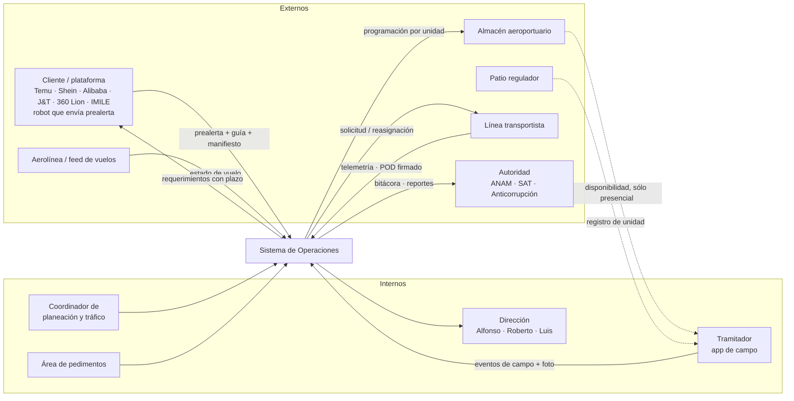

| Rol de sistema | Existe hoy | Acción |
|---|---|---|
| `capturista` | sí | gana las vistas de operación |
| `admin` / `super_admin` | sí | ganan catálogos nuevos y overrides |
| `autoridad` | sí | gana la vista de trazabilidad de operaciones (sólo lectura) |
| **`tramitador`** | **no — nuevo** | sólo app de campo: marcar disponibilidad, ingreso, carga, modulación, evidencia fotográfica |
| **`coordinador`** | **no — nuevo (fase 2)** | planeación y despacho; hoy lo absorbe `capturista` |
| **`cliente`** | **no — fase 3** | portal en inglés: estado de sus guías y sus requerimientos de riesgo |
| **`transportista`** | **no — fase 4** | app tipo Uber; sólo si se decide construirla |

Para el viernes basta agregar **`tramitador`**; `coordinador` se cubre con `capturista` y se separa en fase 2.

---

## 5. Requisitos

El inventario completo `R1`–`R48`, `PA-xx`, `CT-x`, `Q1`–`Q12` está normalizado en la sección 2 y se referencia a lo largo del diseño. Resumen por bloque:

| Bloque | Requisitos | Viernes |
|---|---|---|
| Prealerta e ingesta por correo | R1–R7 | sí |
| Cotejo y banderas rojas | R5 (`PA-01`…`PA-09`) | sí |
| Seguimiento de vuelo | R8–R12 | sí (con fuente por definir, `Q3`) |
| Preplaneación y contingencias | R13–R20, `CT-1`…`CT-7` | parcial: `CT-1`, `CT-4`, `CT-6` |
| Despacho y catálogos | R21–R29 | sí |
| Ingreso, carga, modulación | R30–R35 | sí |
| Tránsito y entrega | R36–R42 | POD sí; GPS no |
| Trazabilidad financiera | R43–R48 | sí, con timbrado de prueba |
| No funcionales | N1–N6 | sí |

---

## 6. El sistema actual — qué ya existe

Levantamiento hecho sobre el repositorio, no sobre suposiciones.

**Stack.** React 19 + Vite + Tailwind 4 al frente (`src/`), Express + Postgres atrás (`server/`), lógica de dominio isomórfica compartida (`shared/`). 36 migraciones con `node-pg-migrate`, aplicadas automáticamente al arrancar el contenedor. Pruebas con Vitest en los tres paquetes.

**Datos.** Tablas relevantes: `users`, `audit_log`, `files`, `manifests`, `shipments`, `monthly_history`, `clients`, `client_platforms`, `client_header_mappings`, `config`, `pedimentos`, `pedimento_scans`, `manifest_staging_rows`, `validated_rfcs`, `agentes_aduanales`, `importadores`.

**Lo que ya resuelve, y que el módulo nuevo debe reutilizar en vez de reinventar:**

| Capacidad existente | Dónde | Cómo la usa Operaciones |
|---|---|---|
| **Registro por guía máster, único global** | `manifests.mawb_reference` con constraint `manifests_mawb_reference_uq` | es el ancla natural de la operación (§8.2) |
| Ingesta de manifiesto Excel multi-hoja, con sinónimos de encabezado y mapeos por cliente | `shared/parsing/*`, `server/src/services/manifestIngest.ts`, `client_header_mappings` | el adjunto del correo entra por aquí, sin código nuevo de parseo |
| Staging bronce/plata → promoción a `shipments` | `manifest_staging_rows`, `POST /api/manifests/:id/promote` | la prealerta deja el manifiesto en `staged`; el cotejo lee de ahí |
| Totales por guía y desglose por caja | `shipments.data` (`Shipment.guideId`, `quantity`, `bulto`, `weightKg`) | insumo de `PA-01`…`PA-03` y `PA-06` |
| **Motor de riesgo versionado**, 9 señales, `ReasonCode[]`, hash de ruleset | `shared/risk/*` (`RULESET.version = '2026-07b'`) | fuente de los requerimientos al cliente (`R18`) |
| Ciclo de vida de pedimento con FSM | `pedimentos.sub_status`: `pendiente → capturado → prevalidado → cargado`, rama `rechazado` | el eje documental de la operación se sincroniza con esto |
| Cobertura manifiesto↔pedimentos y conciliación | `shared/pedimento/coverage.ts`, `reconcile.ts`, `covered_guias` | determina qué guías están liberables |
| Normalización de guías | `shared/pedimento/guia.ts` (`normGuia`) | única forma correcta de comparar guías entre correo, manifiesto y pedimento |
| **Bitácora append-only con cadena de hash** | `audit_log` + trigger `audit_no_update_delete` + `recordAudit()` con `pg_advisory_xact_lock` | los eventos de operación entran a la **misma** cadena |
| Verificación de integridad expuesta | `GET /api/audit/verify`, `AutoridadView` | el viernes se demuestra sobre eventos logísticos también |
| Cifrado de PII a nivel campo + blind index | `server/src/crypto/*`, formato `v1:iv:tag:ct` | aplica a contactos de entrega y datos del transportista |
| Almacenamiento de archivos con hash de contenido | `files` + `storage/<kind>/<uuid>-<nombre>` | correos crudos, AWB, fotos, POD, convenios, facturas |
| Catálogos de cliente y plataforma | `clients`, `client_platforms` (con `email`) | `client_platforms.email` resuelve el remitente del correo → cliente |
| RBAC con `super_admin` como superconjunto de `admin`, MFA obligatorio para roles privilegiados, JWT con `token_version` | `server/src/auth/*` | se extiende con `tramitador` |
| Portal de autoridad y exportable consolidado | `AutoridadView`, `GET /api/consolidated.xlsx` | se extiende con la traza logística |
| Reset de demo con `DEMO_MODE` | `POST /api/admin/demo-reset`, `server/scripts/resetData.ts` | `resetData.ts` ya es genérico; **`demo-reset` sí debe extenderse** (§8.5) |

**Lo que el repositorio NO tiene y este módulo necesita:** no existe planificador de tareas (ni `node-cron`, ni `setInterval` en servidor, ni tabla de tareas), no existe librería de correo entrante ni saliente, y no existe cliente de notificaciones. Es el único hueco de infraestructura, no sólo de producto. Se atiende en §10.

**Lo que hoy significa "seguimiento".** Importante para no confundirse: la vista `Seguimiento` **no** rastrea carga física. Rastrea (a) `manifests.ingestion_status` `draft→staged→promoted`, (b) cobertura `sin_pedimento→parcial→completo`, (c) `pedimentos.sub_status`, (d) veredicto de escaneo del PDF. **No existe ninguna máquina de estados de hitos logísticos**, ni entidad de transporte, ni evidencia de campo, ni POD, ni facturación. Ese es exactamente el hueco.

---

## 7. Análisis de brecha

| Requisito | Estado | Detalle |
|---|---|---|
| R1–R3 correo del robot con dos adjuntos | **nuevo** | no hay ingesta por correo; hoy la carga es manual por UI |
| R3 parseo del manifiesto adjunto | **existe** | `manifestIngest.ts` + `validateManifest` sirven tal cual |
| R4 procedencia asimétrica de campos | **nuevo** | requiere guardar el correo parseado como fuente independiente |
| R5 `PA-01`…`PA-09` cotejo correo↔manifiesto↔vuelo | **parcial** | existe conciliación **pedimento↔manifiesto** (`reconcile.ts`); no existe correo↔manifiesto ni vuelo |
| R6 versionado de prealerta por reenvío | **nuevo** | `manifests` es única por MAWB pero no versiona el aviso |
| R8–R12 vuelo automático, disponibilidad, física de 2 h/7 h | **nuevo** | ninguna noción de vuelo en el sistema |
| R13–R16 planeación día previo, programa por unidad, editable | **nuevo** | — |
| R17 `CT-1`…`CT-7` contingencias automáticas | **nuevo** | — |
| R18 puente riesgo→cliente con plazo duro | **parcial** | el riesgo produce `ReasonCode[]`; no hay requerimiento, plazo ni notificación |
| R19 plan vivo con diff y notificación | **nuevo** | — |
| R20 override humano auditado | **parcial** | `recordAudit()` existe; falta el concepto de override con motivo |
| R21 estatus de despacho | **nuevo** | reemplaza la fórmula de Excel por FSM |
| R22–R24 tipo de unidad primero, catálogos | **nuevo** | — |
| R25 convenios con tarifas, firmados digitalmente | **nuevo** | `files` sirve de soporte; falta modelo y firma |
| R26–R27 robot de llamadas, unidades dedicadas | **nuevo, fase 3–4** | — |
| R28 pantalla de despacho que genera POD | **nuevo** | — |
| R29 una unidad, un destino, N guías, N clientes | **nuevo** | — |
| R30–R35 patio regulador, carga, modulación, semáforo, rojo | **nuevo** | — |
| R36 ETA calculado vs arribo real | **nuevo** | — |
| R37 GPS | **nuevo, fase 3** | — |
| R38 direcciones de entrega por cliente | **nuevo** | `clients` existe; falta la tabla hija |
| R39 POD generado y firmado | **nuevo** | `files` + generadores XLSX existen como base |
| R41 todos los eventos por guía máster, obligatorios | **nuevo** | — |
| R43–R47 proforma/factura ligada a guía y piezas, reporte mensual | **nuevo** | `shared/export/*` sirve de base para el reporte |
| R48 timbrado especial, timbrados de prueba | **nuevo, externo** | dependencia del SAT |
| N1 inmutabilidad | **existe** | la cadena de hash se reutiliza; es el activo más valioso para el viernes |
| N2 registro de overrides | **parcial** | falta `motivo` obligatorio |
| N3 vista de autoridad | **parcial** | hay portal; falta la traza logística |
| N4 captura móvil offline-tolerante | **nuevo** | la UI actual es de escritorio |
| N6 bilingüe | **parcial** | todo en español; falta el eje inglés para cliente y semáforo |

**Seams de integración — los cinco puntos donde el módulo nuevo se enchufa al existente:**

1. `manifests.mawb_reference` ← ancla de la operación.
2. `shared/parsing` + `client_platforms.email` ← ingesta del adjunto y resolución de cliente por remitente.
3. `shared/risk` `ReasonCode[]` → `riesgo_requerimientos` ← el puente que Fernando exigió.
4. `pedimentos.sub_status` + `covered_guias` → elegibilidad de despacho.
5. `recordAudit()` ← toda la traza logística entra a la cadena existente.

---

## 8. Arquitectura objetivo

### 8.1 Diagrama de contexto

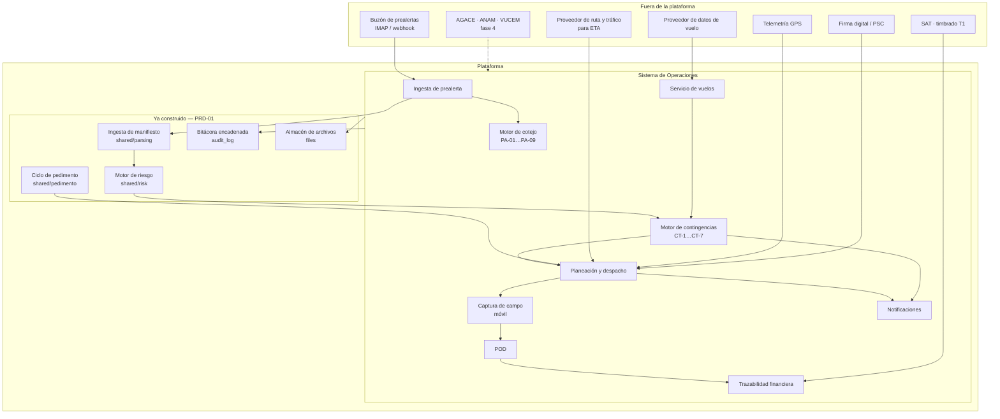

### 8.2 El modelo conceptual: la Operación

**Una operación = una guía máster = un caso.** Se crea al recibir la prealerta (`P1`), aun sin manifiesto validado ni cliente resuelto. Se liga a `manifests` cuando el adjunto se ingesta.

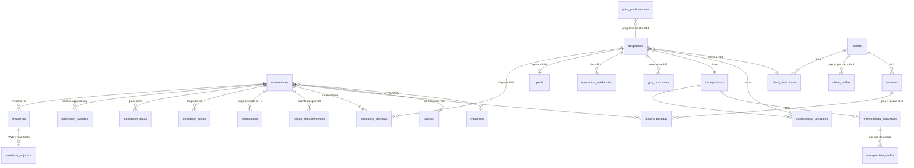

### 8.3 Flujo end-to-end

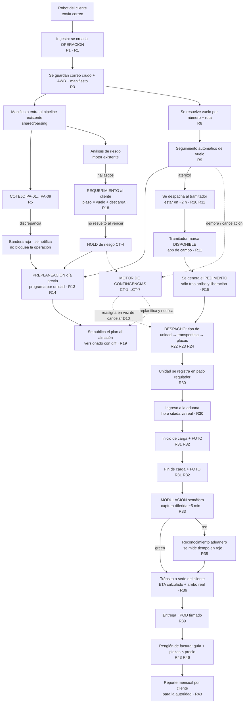

### 8.4 Máquinas de estado — tres ejes independientes

Deliberadamente **tres ejes ortogonales** en lugar de un solo estatus. La fórmula de Excel de Luis (`Q4`) mezclaba avance físico con avance documental, y eso es lo que hace imposible razonar sobre contingencias. Separarlos es lo que permite `P2`.

**Eje 1 — Etapa física** (`operaciones.etapa`, monótona; sólo avanza por hechos observados):

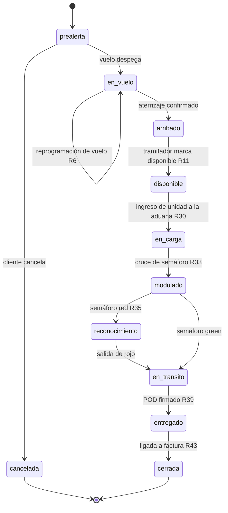

**Eje 2 — Estado documental** (`operaciones.estado_documental`, espejo del módulo de riesgo/pedimento ya existente):

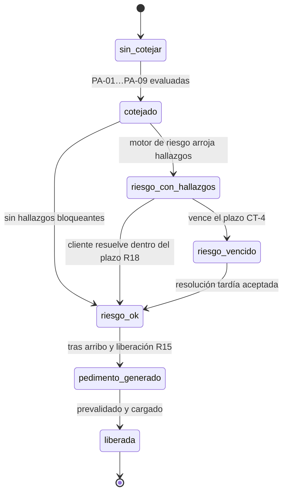

**Eje 3 — Estado de planeación** (`operaciones.estado_planeacion`):

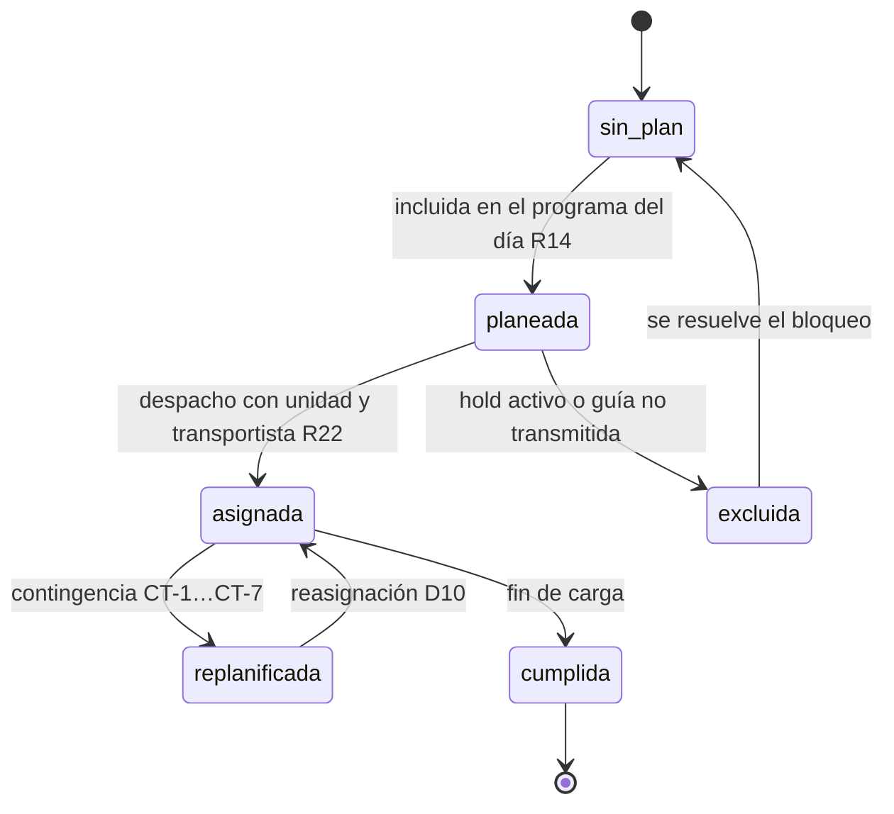

**Ortogonal a los tres: bloqueos y retenciones.** Un `hold` activo no cambia la etapa física; **inhibe transiciones de planeación**. Es el mecanismo de `CT-4` y `CT-6`.

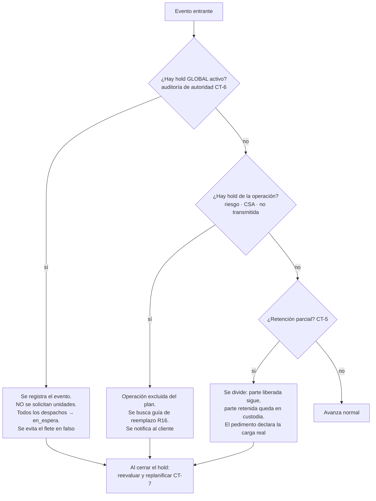

### 8.5 Modelo de datos nuevo

Convenciones respetadas del repositorio: PK `uuid default gen_random_uuid()`; `bigserial` sólo para tablas de alto volumen tipo log; `created_at timestamptz notNull default now()`; `created_by uuid references users on delete set null`; estados como `text` con `CHECK`, **nunca** `ENUM`; payloads en `jsonb`; sin borrado lógico; hijos con `on delete cascade`; JSON de la API en camelCase vía alias `AS "camelCase"`.

#### Núcleo

**`operaciones`** — el caso.

| Columna | Tipo | Notas |
|---|---|---|
| `id` | uuid PK | |
| `mawb` | text notNull **UNIQUE** | guía máster normalizada con `normGuia`; alineada a `manifests.mawb_reference` |
| `mawb_raw` | text | como llegó, para mostrar |
| `manifest_id` | uuid → `manifests` SET NULL | nulo hasta que se ingesta el adjunto (`P1`) |
| `client_id` | uuid → `clients` SET NULL | resuelto por remitente vía `client_platforms.email` |
| `vuelo_id` | uuid → `vuelos` SET NULL | |
| `origen_iata`, `destino_iata` | text | del correo (`R2`) |
| `etd_origen`, `eta_pais` | timestamptz | del correo; se contrastan con `vuelos` (`PA-05`) |
| `cartones_prealerta`, `piezas_prealerta` | integer | totales declarados (`R2`) |
| `peso_kg_prealerta` | numeric | |
| `etapa` | text notNull default `'prealerta'` CHECK | eje 1 |
| `estado_documental` | text notNull default `'sin_cotejar'` CHECK | eje 2 |
| `estado_planeacion` | text notNull default `'sin_plan'` CHECK | eje 3 |
| `semaforo` | text CHECK `('green','red')` | **en inglés** (`R34`, D16) |
| `modulacion_at`, `salida_rojo_at` | timestamptz | `R33`, `R35` |
| `disponible_at`, `arribo_vuelo_at` | timestamptz | `R10`, `R11` |
| `hold_activo` | boolean notNull default false | derivado de `operacion_holds`, materializado para consultas |
| `discrepancias` | jsonb | resultado de cotejo (`PA-xx`) |
| `cotejo_version` | text | versión del ruleset de cotejo |
| `created_by`, `created_at` | | |

Índices: unique en `mawb`; índices en `manifest_id`, `client_id`, `vuelo_id`, `etapa`, `(estado_planeacion, etapa)`.

**`operacion_eventos`** — la línea de tiempo. `bigserial`. **Append-only por trigger**, replicando `audit_no_update_delete`. Columnas: `id`, `operacion_id` uuid → `operaciones` **SET NULL** (ver nota), `operacion_mawb` text notNull (guía máster desnormalizada, para que el evento siga siendo legible si el padre desaparece), `despacho_id` (nullable, SET NULL), `tipo` (text, CHECK sobre catálogo cerrado), `origen` (text CHECK `('sistema','tramitador','coordinador','cliente','transportista','feed_vuelo','feed_gps')`), `ocurrido_at` timestamptz notNull (hora real del hecho — **distinta** de `registrado_at`, indispensable para la captura diferida de modulación, `R33`), `registrado_at` timestamptz notNull default now(), `payload` jsonb, `override` boolean default false, `motivo` text (**obligatorio cuando `override = true`**, `N2`/`R20`), `lat`, `lng` numeric, `evidencia_file_id` → `files` SET NULL, `created_by`, `created_at`. Índices: `(operacion_id, ocurrido_at)`, `operacion_mawb`, `tipo`.

> **Decisión de integridad #1 — una sola cadena.** No se crea una segunda cadena de hash. Cada inserción en `operacion_eventos` invoca además `recordAudit()`, de modo que **una sola cadena verificable cubre documental y logística**. Frente a Anticorrupción, "una cadena, un `GET /api/audit/verify`" es un argumento más fuerte que dos cadenas paralelas.
>
> **Decisión de integridad #2 — el ledger no se borra en cascada.** `operacion_eventos.operacion_id` es `ON DELETE SET NULL`, **no** `CASCADE`, y por eso existe `operacion_mawb` desnormalizado. Motivo: el trigger append-only bloquea `DELETE` a nivel de fila, así que un `CASCADE` haría que borrar una operación fallara siempre; y, más importante, si el borrado en cascada funcionara, **borrar la operación sería una ruta para borrar su historia** — exactamente el agujero que este módulo existe para cerrar. Es el mismo criterio que ya sigue `audit_log`, cuyo `entity_id` es texto sin llave foránea. La consecuencia práctica es deseable: los eventos sobreviven a la operación, huérfanos pero verificables.

**`operacion_guias`** — guía casa dentro de la operación; es la unidad de planeación fina y de retención parcial. Columnas: `id`, `operacion_id` CASCADE, `guia_norm` text notNull (`normGuia`), `guia_raw` text, `client_id` → `clients` SET NULL, `piezas`, `cartones` integer, `peso_kg` numeric, `pedimento_id` → `pedimentos` SET NULL, `estado` text CHECK `('declarada','no_transmitida','csa_pendiente','liberada','retenida','cancelada')`, `created_at`. Unique `(operacion_id, guia_norm)`.

**`prealertas`** — versionado del aviso (`R6`). Columnas: `id`, `operacion_id` CASCADE, `version` integer notNull, `message_id` text **UNIQUE** (idempotencia de reentrega), `recibido_at` timestamptz, `remitente` text, `asunto` text, `headers` jsonb, `cuerpo_texto` text, `parsed` jsonb (campos extraídos con su confianza), `raw_file_id` → `files` SET NULL, `estado` text CHECK `('recibida','parseada','cotejada','rechazada')`, `motivo_rechazo` text, `created_at`. Unique `(operacion_id, version)`.

**`prealerta_adjuntos`** — `id`, `prealerta_id` CASCADE, `file_id` → `files`, `tipo` text CHECK `('awb','manifiesto','otro')`, `content_hash` text, `created_at`.

**`vuelos`** — `id`, `numero_vuelo` text notNull, `aerolinea` text, `origen_iata`, `destino_iata` text, `fecha_operacion` date notNull, `etd_programado`, `eta_programado`, `etd_real`, `eta_estimado`, `arribo_real` timestamptz, `estado` text CHECK `('programado','en_ruta','aterrizado','demorado','cancelado','desconocido')`, `fuente` text, `ultima_consulta_at` timestamptz, `payload_fuente` jsonb, `created_at`. Unique `(numero_vuelo, fecha_operacion)`.

#### Bloqueos, retenciones, riesgo

**`operacion_holds`** — `id`, `operacion_id` → `operaciones` CASCADE **nullable** (nulo ⇒ **hold global**, `CT-6`), `tipo` text CHECK `('riesgo','csa','no_transmitida','auditoria_autoridad','documental','cliente_sin_respuesta','otro')`, `alcance` text CHECK `('global','operacion','guia')`, `operacion_guia_id` → `operacion_guias` SET NULL, `activo` boolean notNull default true, `abierto_at`, `cerrado_at` timestamptz, `abierto_por`, `cerrado_por` → `users` SET NULL, `motivo` text notNull, `created_at`. Índice parcial `WHERE activo` para resolver "¿hay hold global?" en una lectura.

**`retenciones`** — `CT-5`. `id`, `operacion_id` CASCADE, `operacion_guia_id` SET NULL, `alcance` text CHECK `('total','parcial')`, `unidad` text CHECK `('pallet','carton','pieza')`, `cantidad` integer, `motivo` text, `estado` text CHECK `('retenida','liberada','destruida','abandonada')`, `retenida_at`, `liberada_at` timestamptz, `evidencia_file_id` → `files` SET NULL, `oficio_referencia` text, `created_by`, `created_at`.

**`riesgo_requerimientos`** — el puente `R18`/D13. `id`, `operacion_id` CASCADE, `operacion_guia_id` SET NULL, `shipment_id` uuid → `shipments` SET NULL, `reason_codes` jsonb notNull (los `ReasonCode[]` del motor existente), `ruleset_version`, `ruleset_hash` text, `vence_at` timestamptz notNull (**calculado**: `eta_pais` + ventana de descarga), `estado` text CHECK `('abierto','resuelto','vencido','cancelado')`, `notificado_at`, `resuelto_at` timestamptz, `resuelto_por` → `users` SET NULL, `resolucion_nota` text, `evidencia_file_id` → `files` SET NULL, `created_at`. Índice `(estado, vence_at)` para el barrido de vencimientos.

#### Despacho y transporte

**`despachos`** — un viaje de una unidad. `id`, `folio` text UNIQUE, `fecha_operacion` date notNull, `tipo_unidad` text notNull CHECK (glosario completo, `R23`), `transportista_id` → `transportistas` SET NULL, `unidad_id` → `transportista_unidades` SET NULL, `placas` text (desnormalizado al momento del viaje), `operador_nombre` text, `direccion_entrega_id` → `client_direcciones` SET NULL (**un solo destino**, `R29`), `estado` text CHECK `('planeado','solicitado','confirmado','en_patio','en_aduana','cargando','cargado','modulado','en_transito','entregado','cancelado','en_espera')`, `cita_at` timestamptz (hora citada), `ingreso_patio_at`, `ingreso_aduana_at`, `inicio_carga_at`, `fin_carga_at`, `modulacion_at`, `salida_at` timestamptz, `eta_calculado`, `arribo_real` timestamptz (**D14/`R36`**), `tarifa_id` → `transportista_tarifas` SET NULL, `tarifa_monto` numeric, `moneda` text, `reasignado_de_despacho_id` → `despachos` SET NULL (**huella de `CT-7`/D10**), `comentarios` text (`R40`), `created_by`, `created_at`.

**`despacho_partidas`** — `R29`: N guías, N clientes, un destino. `id`, `despacho_id` CASCADE, `operacion_id` → `operaciones` CASCADE, `operacion_guia_id` SET NULL, `pedimento_id` → `pedimentos` SET NULL, `cartones_planeados`, `cartones_cargados` integer, `piezas` integer, `orden_carga` integer (**el consecutivo que pide el almacén**, `R14`), `created_at`. Unique `(despacho_id, operacion_id, operacion_guia_id)`.

**`plan_publicaciones`** — el plan vivo que reemplaza la cadena de Excel (`R19`/`P4`). `id`, `fecha_operacion` date notNull, `version` integer notNull, `snapshot` jsonb notNull, `diff` jsonb (contra la versión anterior), `motivo` text, `publicado_at` timestamptz, `publicado_por` → `users` SET NULL, `destinatarios` jsonb, `created_at`. Unique `(fecha_operacion, version)`.

**`transportistas`** — `id`, `razon_social` text notNull, `rfc` text UNIQUE, `contacto_nombre`, `contacto_telefono`, `contacto_email` text (cifrados en campo con el helper existente), `estado` text CHECK `('activo','suspendido','baja')`, `documentos_ok` boolean default false, `created_by`, `created_at`, `updated_at`.

**`transportista_unidades`** — `id`, `transportista_id` CASCADE, `placas` text notNull, `tipo_unidad` text notNull CHECK, `numero_economico` text, `vigencia_seguro`, `vigencia_verificacion` date, `activo` boolean default true, `created_at`. Unique `(transportista_id, placas)`.

**`transportista_convenios`** — `R25`/D9. `id`, `transportista_id` CASCADE, `file_id` → `files` SET NULL (el contrato), `vigencia_desde`, `vigencia_hasta` date, `estado_firma` text CHECK `('borrador','enviado','firmado','vencido')`, `firmado_at` timestamptz, `firma_proveedor` text, `firma_referencia` text, `firma_evidencia_file_id` → `files` SET NULL, `created_by`, `created_at`.

**`transportista_tarifas`** — `id`, `convenio_id` CASCADE, `tipo_unidad` text notNull CHECK, `direccion_entrega_id` → `client_direcciones` SET NULL (nulo = tarifa general), `tarifa` numeric notNull, `moneda` text notNull default `'MXN'`, `vigencia_desde`, `vigencia_hasta` date, `created_at`.

#### Evidencia, entrega, GPS

**`operacion_evidencias`** — `R32`/D5. `id`, `operacion_id` CASCADE, `despacho_id` SET NULL, `evento_id` bigint → `operacion_eventos` SET NULL, `file_id` → `files` notNull, `tipo` text CHECK `('inicio_carga','fin_carga','modulacion','entrega','retencion','patio','otro')`, `capturado_at` timestamptz notNull (**hora del dispositivo**), `registrado_at` timestamptz notNull default now(), `lat`, `lng` numeric, `device_id` text, `content_hash` text, `created_by`, `created_at`.

**`pods`** — `R39`. `id`, `despacho_id` CASCADE, `folio` text UNIQUE, `file_id_generado` → `files` SET NULL, `file_id_firmado` → `files` SET NULL, `estado` text CHECK `('generado','enviado','firmado','rechazado')`, `firmado_por` text, `firmado_at` timestamptz, `firma_evidencia_file_id` → `files` SET NULL, `observaciones` text, `created_by`, `created_at`.

**`gps_dispositivos`** — fase 3. `id`, `serial` text UNIQUE, `tipo` text CHECK `('gps','gps_temp')`, `estado` text CHECK `('disponible','asignado','en_transito','retirado')`, `despacho_id` SET NULL, `created_at`.

**`gps_posiciones`** — `bigserial`; alto volumen. `id`, `dispositivo_id` → `gps_dispositivos` CASCADE, `despacho_id` SET NULL, `ts` timestamptz notNull, `lat`, `lng`, `velocidad_kmh`, `temperatura_c` numeric, `created_at`. Índice `(despacho_id, ts)`.

#### Catálogos de cliente y finanzas

**`client_direcciones`** — `R38`/D15. Sigue el patrón de `client_platforms`. `id`, `client_id` CASCADE, `alias` text notNull (ej. "IMILE Cuautitlán"), `direccion` text, `ciudad`, `estado`, `cp` text, `lat`, `lng` numeric, `contacto_nombre`, `contacto_telefono` text (cifrados), `horario` text, `activo` boolean default true, `created_by`, `created_at`. Unique `(client_id, alias)`.

**`client_tarifas`** — `R46`. `id`, `client_id` CASCADE, `concepto` text notNull, `unidad` text CHECK `('pieza','guia','kg','carton','despacho')`, `precio` numeric notNull, `moneda` text default `'MXN'`, `vigencia_desde`, `vigencia_hasta` date, `contrato_file_id` → `files` SET NULL, `created_by`, `created_at`.

**`facturas`** — `R43`. `id`, `client_id` → `clients` SET NULL, `tipo` text CHECK `('proforma','cfdi')`, `folio` text, `uuid_cfdi` text UNIQUE nullable, `periodo` text notNull (`YYYY-MM`), `subtotal`, `total` numeric, `moneda` text, `file_id` → `files` SET NULL, `estado` text CHECK `('borrador','emitida','timbrada','cancelada','pagada')`, `timbrado_prueba` boolean default false (`R48`), `created_by`, `created_at`. Índice `(client_id, periodo)`.

**`factura_partidas`** — el renglón que nadie en la industria tiene (`R44`/`R45`). `id`, `factura_id` CASCADE, `operacion_id` → `operaciones` SET NULL, `operacion_guia_id` SET NULL, `despacho_id` SET NULL, `guia_norm` text, `piezas` integer, `precio_unitario` numeric, `importe` numeric, `client_tarifa_id` → `client_tarifas` SET NULL, `created_at`. Índice `(operacion_id)`.

#### Alteraciones a tablas existentes

| Cambio | Migración | Motivo |
|---|---|---|
| Widen `files_kind_check` a `+ 'prealerta_email','awb','pod','convenio','factura','evidencia'` | `..._ops_file_kinds` | mismo patrón que `1700001200000_artifact_files` |
| Widen `users_role_check` a `+ 'tramitador'` | `..._ops_tramitador_role` | mismo patrón que `1700001600000_super_admin_role` |
| Trigger append-only en `operacion_eventos` | `..._ops_events_append_only` | copia de `audit_block_mutation` |
| **Extender `POST /api/admin/demo-reset`** | — | ver nota abajo |

> **Verificado contra el código, con una corrección a lo que se supondría.** `server/scripts/resetData.ts` **no necesita cambios**: ya enumera `pg_tables` y hace `TRUNCATE … RESTART IDENTITY CASCADE` sobre todo salvo `users` y `pgmigrations`, y `TRUNCATE` no dispara triggers de fila, así que pasa limpio sobre `operacion_eventos`.
> `POST /api/admin/demo-reset` **sí** necesita cambios: hoy hace `DELETE FROM manifests` apoyándose en la cascada, más `monthly_history` y `files`. Como `operaciones.manifest_id` es `SET NULL`, ese borrado **no** limpiaría las operaciones. Hay que agregar `DELETE FROM operaciones` (que cascada a `operacion_guias`, `operacion_holds`, `prealertas`, `retenciones`, `riesgo_requerimientos` y `despacho_partidas`), más `despachos`, `vuelos`, `plan_publicaciones` y `facturas`. Y **no** debe intentar borrar `operacion_eventos`: el trigger append-only lo rechazaría y tumbaría la transacción completa — igual que hoy tampoco se borra `audit_log`.

**Orden de migraciones** (continuando la serie, siguiente slot libre `1700003700000`):

```
1700003700000_ops_file_kinds
1700003800000_ops_tramitador_role
1700003900000_operaciones
1700004000000_operacion_eventos          (+ trigger append-only)
1700004100000_prealertas
1700004200000_vuelos
1700004300000_operacion_guias
1700004400000_ops_holds_retenciones
1700004500000_riesgo_requerimientos
1700004600000_transportistas_catalogos
1700004700000_despachos
1700004800000_plan_publicaciones
1700004900000_evidencias_pods
1700005000000_client_direcciones_tarifas
1700005100000_facturas
1700005200000_gps                        (fase 3)
```

### 8.6 Catálogos estáticos compartidos

En `shared/operaciones/catalogos.ts`, siguiendo el patrón de `shared/parsing/catalogs.ts`:

```ts
export const TIPOS_UNIDAD = [
  { id: 'tracto',    label: 'Tracto' },
  { id: 'torton',    label: 'Tortón' },
  { id: 'rabon',     label: 'Rabón' },
  { id: 't3_5',      label: '3.5 toneladas' },
  { id: 'silverado', label: 'Silverado' },
  { id: 'cargo_van', label: 'Cargo van' },
] as const;   // R23 / D8 — glosario completo aunque en práctica sea casi siempre tracto
```

Más `SEMAFORO = ['green','red']` (en inglés por D16), `TIPOS_EVENTO`, `TIPOS_HOLD`, `CODIGOS_DISCREPANCIA`.

### 8.7 Motor de cotejo — las banderas rojas

`shared/operaciones/cotejo.ts`, puro y testeable, versionado igual que `shared/risk/ruleset.ts`:

```ts
export const COTEJO_RULESET_VERSION = '2026-08a';
export function cotejarPrealerta(input: {
  prealerta: PrealertaParsed;
  manifiesto: { cartones: number; piezas: number; pesoKg: number; guias: GuiaTotales[] } | null;
  vuelo: VueloSnapshot | null;
}): Discrepancia[];
```

| Código | Regla | Severidad | Origen |
|---|---|---|---|
| `PA-01` | `cartones` del correo ≠ del manifiesto | error | `R5` |
| `PA-02` | `piezas` del correo ≠ del manifiesto | error | `R5` |
| `PA-03` | `peso` del correo ≠ del manifiesto (con tolerancia declarada) | error | `R5` |
| `PA-04` | el número de vuelo no corresponde a la ruta `origen→destino` | error | `R5` |
| `PA-05` | `eta_pais` del correo inconsistente con el itinerario real | advertencia | `R5`; Alfonso: el itinerario no cambia salvo clima |
| `PA-06` | `piezas` total ≠ suma de piezas por caja del manifiesto | error | `R4`/`R5` |
| `PA-07` | la guía máster ya existe en otra operación abierta | error | integridad |
| `PA-08` | el remitente no resuelve a ningún cliente conocido | advertencia | operativo |
| `PA-09` | consignada a otra agencia aduanal → falta CSA | error → `CT-3` | `R40` |

Las discrepancias **no bloquean** la creación de la operación (`P1`): se registran, se notifican y alimentan al motor de contingencias. Bloquear la ingesta perdería el caso, que es justo lo contrario de lo que se busca.

### 8.8 Motor de contingencias

`shared/operaciones/replan.ts`. Ruleset versionado con hash, mismo patrón que el motor de riesgo, para que sea auditable y reproducible — condición indispensable frente a Anticorrupción (D20).

```ts
export const REPLAN_RULESET_VERSION = '2026-08a';
export function evaluarContingencias(estado: EstadoOperativo): AccionPropuesta[];
export type AccionPropuesta =
  | { tipo: 'excluir_del_plan';  operacionId: string; causa: ContingenciaId }
  | { tipo: 'reasignar_despacho'; despachoId: string; nuevaOperacionId: string }
  | { tipo: 'reprogramar';        operacionId: string; nuevaFecha: string }
  | { tipo: 'abrir_hold';         alcance: 'global'|'operacion'; tipo_hold: HoldTipo }
  | { tipo: 'suspender_solicitud_unidades' }
  | { tipo: 'notificar';          destinatario: Destinatario; plantilla: string };
```

| Id | Disparador | Acción automática |
|---|---|---|
`CT-1` | vuelo demorado o cancelado (feed) | reprogramar la operación; excluir del plan del día; reasignar el despacho a otra guía si existe candidata (D10); notificar almacén, transportista y cliente |
`CT-2` | guía marcada no transmitida | `operacion_guias.estado = 'no_transmitida'`; excluir del plan; buscar reemplazo (`R16`) |
`CT-3` | `PA-09` consignada a otra agencia | abrir hold `csa`; notificar al cliente pidiendo la cesión |
`CT-4` | `riesgo_requerimientos.vence_at` alcanzado sin resolución | abrir hold `riesgo`; excluir del plan; notificar cliente y dirección |
`CT-5` | retención parcial capturada en campo | dividir: parte liberada continúa, parte retenida a custodia; el pedimento declara carga real |
`CT-6` | hold global `auditoria_autoridad` | **suspender solicitud de unidades**; todos los despachos a `en_espera`; se evita el flete en falso |
`CT-7` | despacho contratado que se queda sin carga | **reasignar**, no cancelar: nuevo destino/guía, se recalcula tarifa, se conserva `reasignado_de_despacho_id` |

**Regla de gobierno (D6/`P3`/`R20`).** El motor **ejecuta solo** las acciones de tipo `excluir_del_plan`, `reprogramar`, `abrir_hold`, `suspender_solicitud_unidades` y `notificar`. Las acciones que implican dinero — `reasignar_despacho` con cambio de tarifa — se **proponen** y requieren confirmación humana, que se registra como `override = true` con `motivo` obligatorio en `operacion_eventos`. Así se cumple la instrucción de Alfonso (automatizar) sin dar a un motor la facultad de comprometer gasto sin trazabilidad de quién aprobó.

### 8.9 Puente riesgo ↔ operaciones

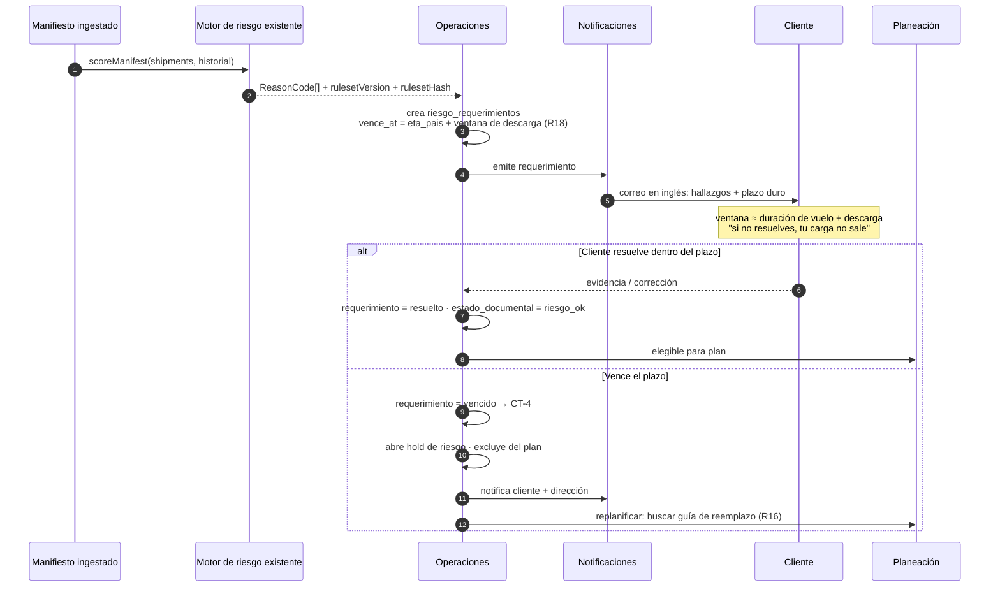

### 8.10 Trazabilidad financiera

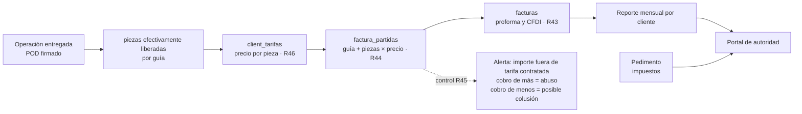

Nota de implementación fiel a Fernando: el vínculo vive **en el sistema**, no dentro del CFDI (D17). El CFDI se adjunta como archivo y se liga; el detalle guía-piezas-importe es una tabla consultable y exportable. Sólo ingresos (D18/`R47`).

### 8.11 Integridad

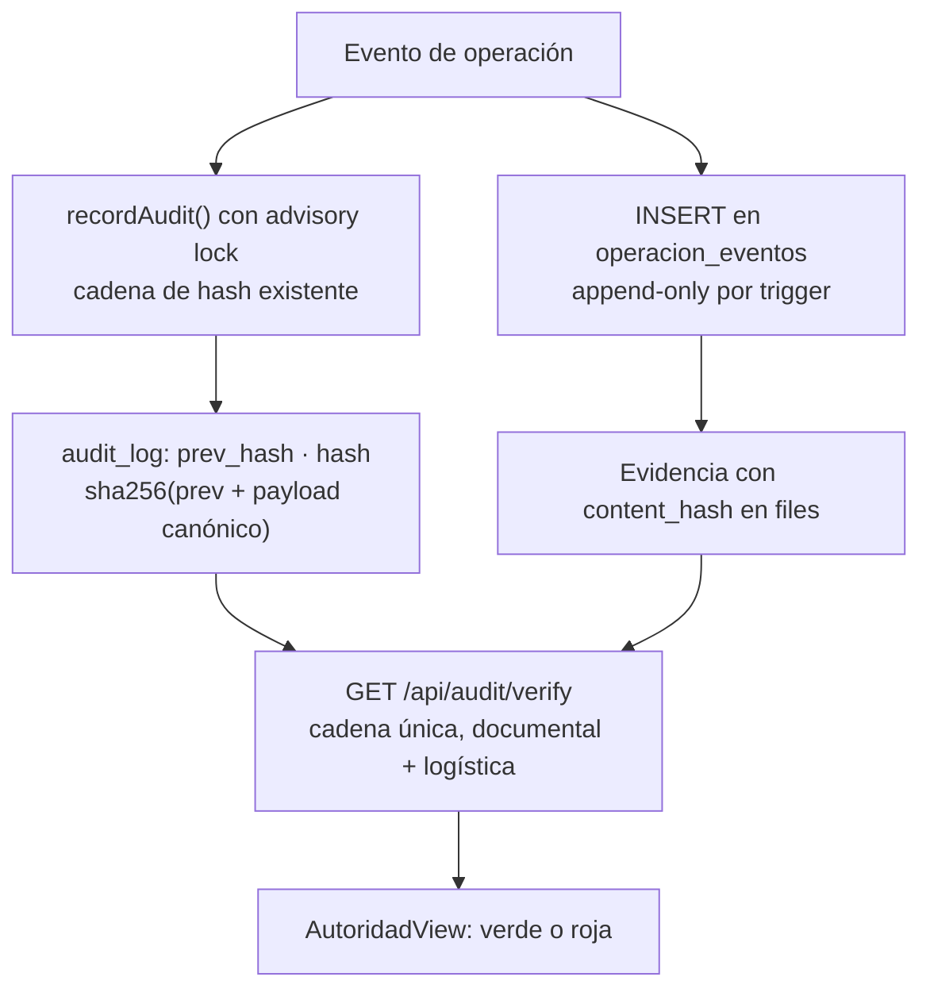

---

## 9. Diagramas de operación

### 9.1 Ingesta de prealerta y cotejo

```mermaid
sequenceDiagram
  autonumber
  participant RB as Robot del cliente
  participant MB as Buzón
  participant IN as Servicio de ingesta
  participant FS as files
  participant PR as Parser de manifiesto
  participant OP as operaciones
  participant CO as Motor de cotejo
  participant AU as Bitácora

  RB->>MB: correo: guía máster, ruta, vuelo, ETD, ETA,<br/>cartones, piezas, peso + AWB + manifiesto
  MB->>IN: entrega (IMAP idle o webhook)
  IN->>IN: message_id ya visto? → idempotente
  IN->>FS: guarda correo crudo + AWB + manifiesto (content_hash)
  IN->>IN: parsea campos; no importa el orden ni los títulos (R1)
  IN->>OP: ¿existe operación con este MAWB?
  alt No existe
    OP-->>IN: crea operación · etapa = prealerta · prealerta v1
  else Ya existe (reenvío por cambio de vuelo)
    OP-->>IN: prealerta v(n+1) sobre la MISMA operación (R6/D2)
    OP->>OP: si cambió el vuelo → dispara CT-1
  end
  IN->>IN: resuelve cliente por remitente vía client_platforms.email
  IN->>PR: ingesta el manifiesto adjunto (pipeline existente)
  PR-->>OP: manifest_id · totales · guías con desglose por caja
  IN->>CO: cotejar(prealerta, manifiesto, vuelo)
  CO-->>OP: Discrepancia[] PA-01…PA-09
  OP->>AU: eventos PREALERTA_RECIBIDA · COTEJO_EJECUTADO
  Note over OP: la operación se crea SIEMPRE (P1).<br/>Las discrepancias se marcan, no bloquean.
```

### 9.2 Vuelo, arribo y disponibilidad de carga

```mermaid
sequenceDiagram
  autonumber
  participant FT as Feed de vuelos
  participant VS as Servicio de vuelos
  participant OP as Operaciones
  participant NT as Notificaciones
  participant TR as Tramitador movil
  participant AL as Almacén

  loop sondeo programado
    VS->>FT: estado de numero_vuelo + fecha
    FT-->>VS: programado / en ruta / demorado / aterrizado / cancelado
    VS->>OP: actualiza vuelos + eta_estimado
    alt Demora o cancelación
      OP->>OP: CT-1 replanifica
      OP->>NT: avisa almacén, transportista y cliente (R19)
    end
  end
  FT-->>VS: ATERRIZÓ
  VS->>OP: etapa = arribado · arribo_vuelo_at
  OP->>NT: tarea al tramitador: "estar en almacén en ~2 h" (R10)
  NT->>TR: notificación push
  Note over AL,TR: descarga ~2 h; el almacén puede tardar<br/>hasta 7 h en marcar disponible, y NO avisa (R11)
  TR->>AL: verifica físicamente
  TR->>OP: botón DISPONIBLE (+ foto opcional)
  OP->>OP: etapa = disponible · disponible_at
  OP->>OP: habilita generación de pedimento (R15)
```

### 9.3 Preplaneación y publicación del plan

```mermaid
sequenceDiagram
  autonumber
  participant OP as Operaciones
  participant RE as Motor de contingencias
  participant PL as Planeación
  participant PB as plan_publicaciones
  participant AL as Almacén
  participant TP as Transportista

  Note over OP: día previo al arribo (R13)
  OP->>RE: estado: vuelos, riesgo, holds, guías
  RE-->>PL: elegibles + exclusiones con causa
  PL->>PL: agrupa por destino único; N guías y N clientes por unidad (R29)
  PL->>PL: tipo de unidad PRIMERO, luego transportista (R22/D7)
  PL->>PL: asigna orden_carga consecutivo (R14)
  PL->>PB: publica versión n con snapshot y diff
  PB->>AL: programación por unidad (prepara y hace espacio)
  PB->>TP: solicitud de unidad con tarifa de convenio
  Note over PB: cada cambio genera versión n+1 con diff.<br/>Sustituye el Excel corrigiendo al Excel (R19/P4)
  RE-->>PL: contingencia posterior
  PL->>PB: versión n+1 + notificación del delta
```

### 9.4 Ingreso, carga y modulación

```mermaid
sequenceDiagram
  autonumber
  participant TP as Transportista
  participant PR as Patio regulador
  participant TR as Tramitador
  participant OP as Operaciones
  participant FS as files

  TP->>PR: llega y se registra (R30)
  TR->>OP: ingreso a patio (hora real)
  Note over OP: se compara cita_at vs real:<br/>cité 10:00, entró 10:05
  PR->>TP: el almacén la llama
  TR->>OP: INGRESO A ADUANA
  TR->>OP: INICIO DE CARGA
  TR->>FS: foto con hora del dispositivo (R32/D5)
  TR->>OP: FIN DE CARGA
  TR->>FS: foto con hora del dispositivo
  Note over TR: en el semáforo no se puede sacar el celular:<br/>captura diferida ~5 min con la hora REAL del hecho (R33)
  TR->>OP: MODULACIÓN · ocurrido_at = hora real · semáforo green|red (R34)
  alt semáforo = red
    OP->>OP: etapa = reconocimiento; arranca contador de tiempo en rojo
    TR->>OP: SALIDA DE ROJO (~2 h, puede ser más) (R35)
    OP->>OP: registra tiempo en rojo como KPI
  else semáforo = green
    OP->>OP: etapa = en_transito
  end
```

### 9.5 Tránsito, entrega y POD

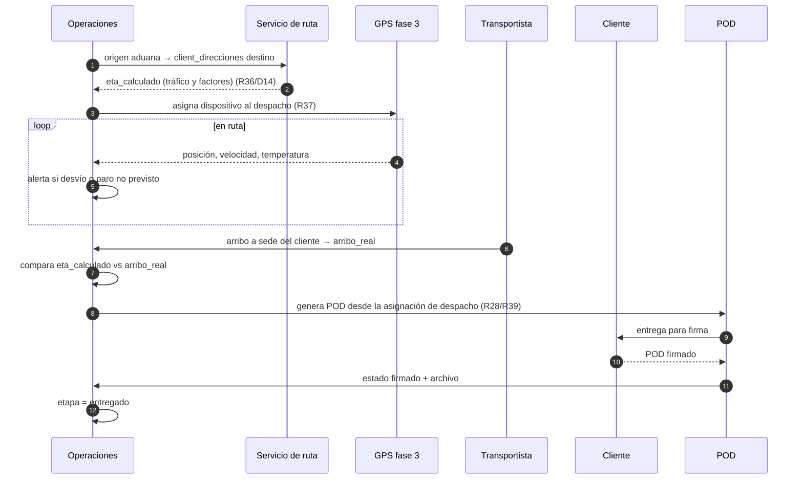

### 9.6 Contingencia: demora de vuelo con reasignación

```mermaid
sequenceDiagram
  autonumber
  participant FT as Feed de vuelos
  participant RE as Motor de contingencias
  participant PL as Planeación
  participant CO as Coordinador
  participant TP as Transportista
  participant AL as Almacén

  FT-->>RE: vuelo demorado 14 h
  RE->>RE: CT-1: las guías de este vuelo no llegan hoy
  RE->>PL: excluir del plan + reprogramar (automático)
  RE->>PL: propone reasignar el tracto ya contratado a otra guía del mismo destino (CT-7/D10)
  PL->>CO: propuesta con delta de tarifa
  Note over CO: única confirmación humana requerida:<br/>compromete dinero. Se registra override + motivo (R20/N2)
  CO-->>PL: confirma
  PL->>TP: nueva asignación; NO es flete en falso, es cambio de tarifa
  PL->>AL: plan versión n+1 con diff
  Note over PL: sin la reasignación habría flete en falso;<br/>con ella sólo cambia la tarifa
```

### 9.7 Retención parcial

```mermaid
sequenceDiagram
  autonumber
  participant TR as Tramitador
  participant OP as Operaciones
  participant PD as Módulo de pedimento
  participant CL as Cliente

  TR->>OP: se detiene 1 pallet a revisión; el resto sale (CT-5)
  OP->>OP: crea retención parcial: unidad = pallet, cantidad = 1
  OP->>OP: guías afectadas → estado retenida; el resto → liberada
  OP->>PD: el pedimento declara la CARGA REAL que sale, contra el manifiesto
  OP->>CL: notifica: qué sale hoy y qué queda en custodia
  Note over OP: el pallet permanece resguardado hasta liberación,<br/>con su propio ciclo retenida → liberada
  OP->>OP: al liberarse, se reincorpora al plan
```

### 9.8 Cierre financiero mensual

```mermaid
sequenceDiagram
  autonumber
  participant OP as Operaciones
  participant FN as Trazabilidad financiera
  participant SAT as SAT timbrado
  participant AU as Autoridad

  OP-->>FN: operaciones entregadas del periodo con piezas liberadas por guía
  FN->>FN: aplica client_tarifas (ej. 0.05 por pieza) (R46)
  FN->>FN: genera factura_partidas: guía + piezas × precio (R44)
  FN->>FN: arma proforma
  FN->>SAT: timbra (prueba hasta que se habilite el T1 especial) (R48)
  SAT-->>FN: CFDI
  FN->>FN: liga CFDI a las partidas — el vínculo vive aquí, no en el CFDI (D17)
  FN->>FN: valida importe contra tarifa contratada (R45)
  FN->>AU: reporte mensual por cliente: guías, piezas, importes, pedimentos
  Note over AU: impuestos vienen del pedimento;<br/>honorarios de los despachos. Traza completa de ingresos.
```

---

## 10. API

Todas las rutas siguen el idioma existente: `requireAuth` → `requireRole(...)` → `validate({...})` → handler con `try/catch(next)`, `recordAudit()` después de que la transacción commitea, respuestas en camelCase por alias SQL.

**Nuevos módulos de rutas** en `server/src/routes/`: `operaciones.ts`, `prealertas.ts`, `vuelos.ts`, `despachos.ts`, `campo.ts`, `transportistas.ts`, `pods.ts`, `facturacion.ts`.

| Método y ruta | Rol | Descripción |
|---|---|---|
| `POST /api/prealertas/inbound` | token de servicio | webhook de correo entrante; idempotente por `message_id`; crea o versiona la operación (`R1`,`R6`) |
| `GET /api/prealertas/:id` | auth | prealerta con sus adjuntos y parseo |
| `POST /api/prealertas/:id/recotejar` | admin, capturista | vuelve a correr `PA-01…PA-09` |
| `GET /api/operaciones` | auth | tablero: filtros por etapa, fecha, cliente, hold, discrepancia |
| `GET /api/operaciones/:id` | auth | detalle con los tres ejes, timeline, guías, holds, requerimientos, despachos |
| `GET /api/operaciones/:id/timeline` | auth | `operacion_eventos` ordenado por `ocurrido_at` |
| `POST /api/operaciones/:id/eventos` | admin, capturista, tramitador | registra evento; exige `motivo` si `override` (`R20`) |
| `POST /api/operaciones/:id/holds` | admin, capturista | abre hold (`CT-3`,`CT-4`) |
| `DELETE /api/operaciones/:id/holds/:holdId` | admin | cierra hold; dispara reevaluación |
| `POST /api/operaciones/holds/global` | admin | **hold global por auditoría de la autoridad** (`CT-6`) |
| `POST /api/operaciones/:id/retenciones` | admin, capturista, tramitador | retención total o parcial (`CT-5`) |
| `POST /api/operaciones/:id/retenciones/:rid/liberar` | admin, capturista | libera y reincorpora al plan |
| `GET /api/vuelos/:id` | auth | estado y snapshot de la fuente |
| `POST /api/vuelos/sync` | admin | sondeo manual (el automático es tarea programada) |
| `GET /api/planeacion?fecha=` | auth | plan del día con elegibles y exclusiones con causa |
| `POST /api/planeacion/publicar` | admin, capturista | publica versión con diff y notifica (`R19`) |
| `GET /api/planeacion/publicaciones?fecha=` | auth, autoridad | historial versionado del plan |
| `POST /api/despachos` | admin, capturista | crea despacho: **tipo de unidad primero** (`R22`) |
| `PUT /api/despachos/:id` | admin, capturista | edita asignación (`R28`) |
| `POST /api/despachos/:id/partidas` | admin, capturista | agrega guía al camión (`R29`) |
| `POST /api/despachos/:id/reasignar` | admin, capturista | reasignación anti-flete-en-falso; exige `motivo` (`CT-7`) |
| `POST /api/despachos/:id/pod` | admin, capturista | genera POD (`R39`) |
| `POST /api/pods/:id/firmado` | admin, capturista | sube POD firmado |
| `POST /api/campo/despachos/:id/evento` | tramitador | evento de campo con `ocurridoAt`, `lat`, `lng` |
| `POST /api/campo/evidencias` | tramitador | sube foto; multipart; `capturadoAt` del dispositivo (`R32`) |
| `GET /api/campo/tareas` | tramitador | cola del tramitador: vuelos por aterrizar, cargas pendientes |
| `GET/POST/PUT/DELETE /api/transportistas...` | admin | líneas, unidades, convenios, tarifas (`R24`,`R25`) |
| `POST /api/transportistas/:id/convenios/:cid/firmar` | admin | inicia firma digital (D9) |
| `GET/POST/PUT/DELETE /api/catalogs/clients/:id/direcciones` | admin, capturista | direcciones de entrega (`R38`) |
| `GET/POST/PUT/DELETE /api/catalogs/clients/:id/tarifas` | admin | precio por pieza (`R46`) |
| `GET /api/facturacion/preliquidacion?clientId=&periodo=` | admin | piezas liberadas × tarifa, antes de facturar |
| `POST /api/facturacion/facturas` | admin | crea proforma o CFDI con sus partidas (`R43`,`R44`) |
| `POST /api/facturacion/facturas/:id/archivo` | admin | sube proforma o CFDI |
| `GET /api/facturacion/reporte-mensual.xlsx?clientId=&periodo=` | admin, autoridad | reporte mensual por cliente (`R43`) |
| `GET /api/autoridad/operaciones.xlsx?desde=&hasta=` | autoridad, admin | traza logística consolidada (`N3`) |
| `GET /api/riesgo-requerimientos` | auth | requerimientos abiertos y por vencer |
| `POST /api/riesgo-requerimientos/:id/resolver` | admin, capturista | marca resuelto con evidencia |

**Tarea programada — hueco de infraestructura detectado.** El repositorio **no tiene ningún planificador**: no hay `node-cron`, ni `setInterval` en el servidor, ni tabla de tareas. Tampoco hay librería de correo (`nodemailer`, `imapflow`) ni cliente de mensajería. Los cuatro procesos periódicos que este módulo necesita —sondeo de vuelos (`R9`), barrido de `riesgo_requerimientos` vencidos → `CT-4`, recálculo de ETA (`R36`) y evaluación del motor de contingencias— necesitan un mecanismo que hoy no existe.

Recomendación, en orden de menor riesgo para el viernes:

1. **Endpoint autenticado + tarea programada de Coolify** (`POST /api/ops/tick`, protegido por `OPS_TICK_TOKEN`). Cero dependencias nuevas, cero estado en proceso, y la ejecución queda registrada fuera de la aplicación — lo cual además es auditable. Es la opción para fase 0, dado que el despliegue ya vive en Coolify.
2. `setInterval` en el arranque de `server/src/index.ts`, con guarda de instancia única. Simple, pero se duplica si algún día hay más de una réplica.
3. `node-cron` en proceso. Innecesario si ya se eligió (1).

Y para el correo, que tampoco existe hoy:

- **Entrada** (`R1`): buzón dedicado en un proveedor con webhook entrante que hace `POST /api/prealertas/inbound`. Es preferible a IMAP porque no requiere proceso residente ni polling. Si se insiste en IMAP, hay que agregar `imapflow` y un worker, y eso ya es infraestructura nueva.
- **Salida** (`R18`,`R19`, `N5`): API de un proveedor transaccional. El correo al cliente debe ir **en inglés** (`N6`) y con el plazo duro explícito.

Ambos son decisiones de contratación pequeñas pero **bloquean la demo del viernes si no se toman a inicio de semana**. Se suman como `Q13` y `Q14`.

**Acciones de bitácora nuevas** (`SCREAMING_SNAKE_CASE`, convención existente): `PREALERTA_RECIBIDA`, `PREALERTA_VERSIONADA`, `COTEJO_EJECUTADO`, `OPERACION_CREADA`, `VUELO_ACTUALIZADO`, `CARGA_DISPONIBLE`, `HOLD_ABIERTO`, `HOLD_CERRADO`, `HOLD_GLOBAL_ABIERTO`, `RETENCION_CREADA`, `RETENCION_LIBERADA`, `REQUERIMIENTO_EMITIDO`, `REQUERIMIENTO_RESUELTO`, `REQUERIMIENTO_VENCIDO`, `PLAN_PUBLICADO`, `DESPACHO_CREADO`, `DESPACHO_REASIGNADO`, `INGRESO_PATIO`, `INGRESO_ADUANA`, `INICIO_CARGA`, `FIN_CARGA`, `MODULACION`, `SALIDA_ROJO`, `EVIDENCIA_CAPTURADA`, `POD_GENERADO`, `POD_FIRMADO`, `FACTURA_CREADA`, `FACTURA_LIGADA`, `OVERRIDE_MANUAL`.

---

## 11. Frontend

Se respeta el modelo actual: sin router, `Section` en `src/nav.ts`, conmutación por `{current === 'x' && <XView/>}` en `App.tsx`, `visibleSectionsFor` como única compuerta centralizada, componentes de `src/components/ui`, español interno, `StatusPill` para semáforos.

**Nuevas `Section`:**

```ts
| 'ops_torre' | 'ops_prealertas' | 'ops_planeacion' | 'ops_despachos'
| 'ops_campo' | 'ops_retenciones' | 'ops_entregas' | 'ops_facturacion'
| 'cfg_transportistas' | 'cfg_direcciones' | 'cfg_tarifas'
```

Nuevo grupo en `NAV_GROUPS`, entre "Operación" y "Consulta":

```
Logística
  Torre de Control      ops_torre        (Radar)
  Prealertas            ops_prealertas   (Inbox)
  Planeación            ops_planeacion   (CalendarClock)
  Despachos             ops_despachos    (Truck)
  Carga retenida        ops_retenciones  (PackageX)
  Entregas y POD        ops_entregas     (ClipboardCheck)
  Trazabilidad financiera ops_facturacion (Receipt)
```

`cfg_transportistas`, `cfg_direcciones` y `cfg_tarifas` se suman a `ConfigSection` y a los `children` de Configuración; `ConfigurationView` ya está construido para recibir un `domain`, así que son tres dominios más, no vistas nuevas.

Visibilidad por rol en `visibleSectionsFor`:

| Rol | Añade |
|---|---|
| `capturista` | `ops_torre`, `ops_prealertas`, `ops_planeacion`, `ops_despachos`, `ops_retenciones`, `ops_entregas` |
| `admin` / `super_admin` | todas las anteriores + `ops_facturacion` + los tres `cfg_*` |
| `autoridad` | `ops_torre` en modo lectura + `ops_facturacion` en modo lectura |
| `tramitador` | **sólo** `ops_campo` |

**Vistas:**

- **`TorreControlView`** — el tablero que se muestra el viernes. Filas = operaciones; columnas = los tres ejes; cuenta regresiva de requerimientos de riesgo por vencer; franja de semáforo con `StatusPill`; banda superior roja cuando hay hold global activo. Auto-refresco por polling (coherente con la ausencia de librería de datos; websockets quedan para fase 3).
- **`PrealertasView`** — bandeja: correo recibido, versión, adjuntos, campos parseados y **discrepancias `PA-xx` en rojo junto al campo que las produjo**. Permite ver el correo crudo — que es exactamente el artefacto que Fernando le pidió a Luis anotado.
- **`PlaneacionView`** — plan del día: elegibles, exclusiones con causa visible, agrupación por destino, `orden_carga` arrastrable, botón "Publicar versión" que muestra el diff antes de enviar (`R19`).
- **`DespachosView`** — flujo forzado **tipo de unidad → transportista → placas** (`R22`/D7), asignación de N guías de N clientes a un destino (`R29`), y "Generar POD" (`R28`).
- **`CampoView`** — la app del tramitador. Pantalla propia, mobile-first, sin sidebar, botones grandes de una sola pulsación: `Disponible`, `Ingreso a patio`, `Ingreso a aduana`, `Inicio de carga`, `Fin de carga`, `Modulación`, `Salida de rojo`. Cámara integrada para inicio y fin de carga. **Captura diferida**: en modulación pide la hora real del hecho, no la del registro (`R33`). Cola local con reintento para tolerar conectividad de almacén (`N4`).
- **`RetencionesView`** — carga retenida, total o parcial, con evidencia y ciclo hasta liberación (`CT-5`).
- **`EntregasView`** — POD generados, enviados, firmados; ETA calculado contra arribo real (`R36`).
- **`FacturacionView`** — preliquidación por cliente y periodo, partidas guía-piezas-importe, carga de proforma y CFDI, alerta cuando el importe se sale de la tarifa contratada (`R45`), y descarga del reporte mensual.

**Pruebas**: un `.test.tsx` colocado por vista, `vi.mock('../api', …)`, aserciones con `toBeTruthy()`, `waitFor` para el fetch — igual que el resto del repositorio.

---

## 12. Integraciones externas

| Integración | Requisito | Nota |
|---|---|---|
| **Buzón de prealertas (entrante)** | `R1` | **no existe nada hoy** (`Q13`). Recomendado: buzón dedicado + webhook entrante → `POST /api/prealertas/inbound`; IMAP con worker como alternativa más cara. Idempotencia por `message_id`. El correo crudo se archiva como evidencia. |
| **Correo saliente / notificaciones** | `R18`,`R19`,`N5` | **no existe nada hoy** (`Q13`). Requerimientos al cliente en inglés (`N6`); avisos de cambio de plan a almacén y transportista. |
| **Planificador de tareas** | `R9`,`CT-4`,`R36` | **no existe nada hoy** (`Q14`). Recomendado: tarea programada de Coolify → `POST /api/ops/tick` con `OPS_TICK_TOKEN`. Cero dependencias nuevas. |
| **Datos de vuelo** | `R8`,`R9` | **`Q3` sin cerrar.** Ver la nota de precisión abajo. |
| **Ruta y tráfico para ETA** | `R36` | cualquier proveedor de ruteo; requiere `client_direcciones` con lat/lng |
| **GPS** | `R37` | `Q5`; alternativa sin costo: cuenta espejo de telemetría del transportista, como apuntó Luis |
| **Firma digital de convenios** | `R25`/D9 | PSC mexicano con e.firma; queda `firma_referencia` + evidencia |
| **SAT timbrado T1** | `R48` | dependencia externa; timbrados de prueba para la demo |
| **AGACE / ANAM / VUCEM** | `C7` | fase 4, tras la autorización; `Q12` |

> **Nota de precisión sobre los datos de vuelo.** En la reunión se dijo que todos los vuelos reportan por ley a un sistema central mundial y que por eso el dato es gratis, siendo FlightRadar sólo una vista. Es cierto en parte y conviene tenerlo claro antes de comprometerlo el viernes: la **posición** de las aeronaves sí viaja por ADS-B y hay redes abiertas que la publican sin costo (OpenSky, adsb.lol), y de ahí se puede derivar despegue y aterrizaje. Pero el **itinerario programado y el estado oficial del vuelo** (ETD/ETA publicados, cancelaciones, cambio de equipo) no salen de un único registro público gratuito: se distribuyen por feeds comerciales de aerolíneas y agregadores (FlightAware AeroAPI, Cirium, AviationStack, entre otros), con costo por consulta. Recomendación: **ADS-B gratuito para el hecho físico** (despegó, aterrizó, hora real) y **un feed comercial de bajo costo para el itinerario** (`PA-04`, `PA-05`). Es una decisión de contratación menor, pero es mejor cerrarla ahora que descubrirla en la demo.

---

## 13. Seguridad, RBAC y PII

- **Rol nuevo `tramitador`**: privilegio mínimo real. Sólo `POST /api/campo/*` y `GET /api/campo/tareas`. No lee manifiestos, ni riesgo, ni pedimentos, ni facturación. Es el rol con más exposición física, así que es el que menos debe poder ver.
- **MFA**: `getMfaEnforcement()` hoy obliga MFA a los roles privilegiados. `tramitador` **no** debe entrar a `PRIVILEGED_ROLES` — un TOTP en el andén de carga es fricción sin beneficio. Se compensa con tokens de sesión de vida corta y vinculación de dispositivo.
- **PII**: contactos de entrega y del transportista pasan por `encryptField` y sus blind index, igual que consignatario y remitente hoy.
- **Fotos y geolocalización**: son datos personales del operador y del conductor. Se conserva sólo lo necesario (`capturado_at`, `lat`, `lng`, `content_hash`), con política de retención declarada. Conviene incluirlo en el aviso de privacidad antes del viernes.
- **`autoridad` sigue siendo sólo lectura**, con el patrón de auditoría *fail-closed* ya usado en `consolidated.ts`: si la escritura de bitácora falla, el artefacto no se entrega.
- **Override**: `motivo` obligatorio a nivel de esquema de validación, no sólo de UI.

---

## 14. Plan de implementación

### Fase 0 — Corte para el viernes 7 de agosto

Objetivo: demostrar **trazabilidad total e inmutable de una operación completa**, con datos sembrados y realistas. No se demuestra volumen; se demuestra que nada se puede mover sin dejar rastro.

| # | Entregable | Por qué está dentro |
|---|---|---|
| 1 | Migraciones `1700003700000`–`1700005100000` (sin GPS) | base de todo |
| 2 | Ingesta de prealerta con archivo del correo crudo + versionado (`R1`,`R6`) | es el arranque del caso y la prueba de que no se captura a mano |
| 3 | Motor de cotejo `PA-01`…`PA-09` visible en pantalla (`R5`) | es lo que un Excel no puede hacer; alto impacto ante la autoridad |
| 4 | Seguimiento de vuelo automático, aunque sea con un solo proveedor y sondeo cada 15 min (`R8`,`R9`) | sustenta "no dependemos de que alguien mire una página" |
| 5 | `CampoView` con los 7 botones y foto con hora (`R11`,`R31`–`R35`) | es la respuesta a "sigues dependiendo de un cabrón": el cabrón ya no escribe en Excel, deja evidencia |
| 6 | Torre de Control con los tres ejes y hold global (`CT-6`) | la pantalla que se proyecta |
| 7 | Planeación con publicación versionada y diff (`R14`,`R19`) | reemplaza visiblemente la cadena de Excels |
| 8 | Despacho con orden unidad→transportista, N guías/N clientes, POD generado (`R22`,`R28`,`R29`,`R39`) | cierra el ciclo físico |
| 9 | Requerimiento de riesgo con plazo duro y `CT-4` (`R18`) | es el puente entre los dos sistemas; el argumento más fuerte de arquitectura |
| 10 | Trazabilidad financiera: partidas guía-piezas-importe + reporte mensual (`R43`–`R46`) | es la petición literal de ANAM del 31 de julio |
| 11 | Todos los eventos en la cadena de hash + `verify` verde en el portal (`N1`,`N3`) | es *el* argumento frente a Anticorrupción |
| 12 | Catálogos: transportistas, unidades, convenios con tarifas, direcciones, tarifas de cliente | sin ellos las pantallas están vacías |
| 13 | `demo-reset` extendido a las tablas nuevas (`resetData.ts` ya sirve tal cual) | para poder reiniciar la demo entre ensayos |
| 13b | Planificador mínimo: `POST /api/ops/tick` + tarea programada de Coolify; webhook de correo entrante; proveedor de correo saliente | **hueco de infraestructura**; sin esto no hay sondeo de vuelo ni vencimiento de requerimientos |
| 14 | Datos sembrados: HKG→NLU, clientes Temu/Shein/Alibaba, destino IMILE, un caso con discrepancia, uno con semáforo rojo, uno con retención parcial, uno con demora de vuelo reasignada | el guion de la demo |

**Fuera del viernes, explícitamente:** robot de llamadas a transportistas (`R26`), unidades dedicadas (`R27`), GPS (`R37`), portal del cliente, firma digital productiva de convenios, timbrado real T1, interfaces AGACE/ANAM/VUCEM, QR por caja (`R42`, ya descartado).

### Fases siguientes

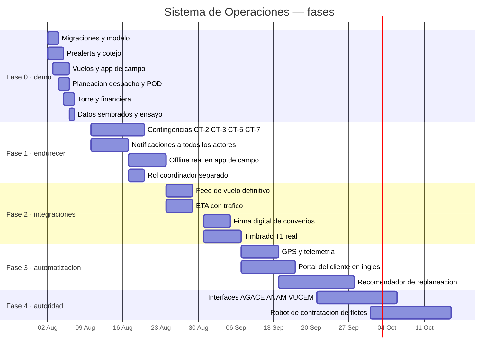

---

## 15. Riesgos

| # | Riesgo | Impacto | Mitigación |
|---|---|---|---|
| 1 | **No llegan los artefactos de Luis** (`Q1`,`Q4`,`Q6`) antes del miércoles | el parseo de prealerta y el POD se construyen a ciegas y no coinciden con la realidad | el parser es tolerante al orden y a los títulos por diseño (`R1`); el POD se hace configurable por plantilla; pero **hay que insistir hoy mismo** |
| 2 | **El itinerario de vuelo no es gratis** (nota §12) | `PA-04`/`PA-05` sin fuente el viernes | ADS-B gratuito para el hecho físico + prueba gratuita de un feed comercial para el itinerario |
| 3 | **Alcance excesivo para 4 días hábiles** | demo incompleta ante Anticorrupción | corte de fase 0 explícito; nada a medias en pantalla |
| 4 | **Fernando de vacaciones** | preguntas sin resolver bloquean al equipo | este documento resuelve por defecto y marca supuestos; las 12 preguntas abiertas están aisladas para que no bloqueen el resto |
| 5 | **Discrepancia de datos en el ejemplo** (`Q2`: 52.64 vs 570 kg) | tolerancias de `PA-03` mal calibradas | tolerancia configurable, no constante en código |
| 6 | Conectividad en almacén y aduana | se pierden eventos de campo | cola local con reintento desde fase 0; offline real en fase 1 |
| 7 | Resistencia operativa al cambio (la posición de Luis es legítima: hoy funciona) | el sistema se llena de overrides y la traza pierde valor | los overrides son visibles y contables: si el 40 % de las transiciones son manuales, eso es un dato de gestión, no un fallo del sistema |
| 8 | **Sin timbrado T1 real** | la demo financiera puede leerse como incompleta | rotular explícitamente "timbrado de prueba" en pantalla; presentarlo como dependencia del SAT, no como faltante propio |
| 9 | La autoridad pide algo no contemplado el viernes mismo | — | el modelo de eventos es extensible sin migración: `operacion_eventos.payload` es `jsonb` |
| 10 | El reset de demo deja datos huérfanos | demo sucia | ítem 13 de fase 0 |
| 11 | **No hay planificador ni correo en el repositorio** (§6, §10) | sin ellos no hay ingesta automática de prealerta, ni sondeo de vuelo, ni vencimiento de requerimientos — es decir, se cae justo la parte que demuestra que no dependemos de un humano | decidir `Q13` y `Q14` **el lunes**; la opción recomendada no agrega dependencias, sólo un endpoint y una tarea de Coolify |
| 12 | Se borra una operación y con ella su historia | sería exactamente el agujero que el módulo debe cerrar | `operacion_eventos` es append-only y **no** cascada; los eventos sobreviven huérfanos y verificables (§8.5, decisión #2) |

---

## 16. Preguntas abiertas

| # | Pregunta | Para | Bloquea |
|---|---|---|---|
| `Q1` | Correo de prealerta real, **anotado campo por campo**, con los dos adjuntos (AWB en PDF, manifiesto en Excel) | Luis | calibración del parser; no bloquea la arquitectura |
| `Q2` | El peso del ejemplo: 52.64 o 570 kg | Luis | tolerancia de `PA-03` |
| `Q3` | Fuente de datos de vuelo: ¿se contrata un feed comercial de itinerario o basta ADS-B? | Alfonso (costo) | `PA-04`, `PA-05` |
| `Q4` | Diccionario de datos: la **fórmula de estatus** de Excel, tipos, tamaños y el cálculo de E-time | Luis | validación de la máquina de estados |
| `Q5` | GPS: ¿dispositivo propio o cuenta espejo del transportista? | Alfonso / Luis | fase 3 |
| `Q6` | **Plantilla de POD** que se quiere reproducir | Luis | generación del POD |
| `Q7` | Contrato de prestación de servicios de transportista + estructura de tarifas por tipo de unidad | Alfonso | `R25` |
| `Q8` | Direcciones de entrega por cliente (J&T, 360 Lion, IMILE, Temu, Shein, Alibabá) | Luis | `R38`, ETA |
| `Q9` | Precio por cliente ($/pieza u otro) | Alfonso | `R46` |
| `Q10` | Patio regulador: ¿hay sistema con el que integrarse o es captura manual? | Luis | `R30` |
| `Q11` | ¿Existe algún feed electrónico de disponibilidad de carga o de resultado de semáforo? En la reunión se dijo que no | Luis | confirma que la app de campo es la única fuente |
| `Q12` | ¿Cuál interfaz de autoridad primero: AGACE, ANAM o VUCEM, y con qué especificación? | Alfonso | fase 4 |
| `Q13` | ~~**Proveedor de correo**: ¿buzón dedicado con webhook entrante o IMAP con worker?~~ → **RESUELTA en la Adenda A**: se usa **AGORA** como hub (ActionMailbox + webhook firmado + API de mensajes). Queda sólo elegir el ingress → `Q15` de la adenda | — | — |
| `Q14` | **Planificador**: ¿se usa tarea programada de Coolify contra `POST /api/ops/tick` (recomendado) o `setInterval` en proceso? | Fernando | **bloquea `R9` y `CT-4` para el viernes** |

**Supuestos tomados por defecto para no bloquear** (a corregir si alguien objeta): tolerancia de peso 0.5 %; ventana de descarga para el plazo de riesgo, 3 h después del ETA; sondeo de vuelo cada 15 min y cada 5 min en la ventana de arribo; folio de despacho `DSP-YYYYMMDD-nnn`; folio de POD `POD-YYYYMMDD-nnn`; moneda por defecto MXN; retención de fotos 5 años, alineada al plazo fiscal.

---

## 17. Anexo · nombres exactos

**Tablas nuevas — 22 en fases 0–2:** `operaciones`, `operacion_eventos`, `operacion_guias`, `operacion_holds`, `operacion_evidencias`, `prealertas`, `prealerta_adjuntos`, `vuelos`, `retenciones`, `riesgo_requerimientos`, `despachos`, `despacho_partidas`, `plan_publicaciones`, `transportistas`, `transportista_unidades`, `transportista_convenios`, `transportista_tarifas`, `pods`, `client_direcciones`, `client_tarifas`, `facturas`, `factura_partidas`. **Más 2 en fase 3:** `gps_dispositivos`, `gps_posiciones` — **24 en total**.

*Colisiones verificadas contra las 16 tablas existentes (`agentes_aduanales`, `audit_log`, `client_header_mappings`, `client_platforms`, `clients`, `config`, `files`, `importadores`, `manifest_staging_rows`, `manifests`, `monthly_history`, `pedimento_scans`, `pedimentos`, `shipments`, `users`, `validated_rfcs`): **ninguna**. Igual verificado: ninguno de los 9 archivos de ruta ni de las 8 vistas propuestas existe ya, y `shared/operaciones/` no existe.*

**Módulos compartidos nuevos:** `shared/operaciones/catalogos.ts`, `cotejo.ts`, `replan.ts`, `estados.ts`, `folios.ts`, `types.ts` — más sus `.test.ts`, siguiendo el patrón de `shared/risk/` y `shared/pedimento/`.

**Servicios de servidor nuevos:** `server/src/services/prealertaIngest.ts`, `vuelosService.ts`, `planeacion.ts`, `contingencias.ts`, `podBuilder.ts`, `facturacionService.ts`, `notificaciones.ts`.

**Rutas nuevas:** `server/src/routes/operaciones.ts`, `prealertas.ts`, `vuelos.ts`, `planeacion.ts`, `despachos.ts`, `campo.ts`, `transportistas.ts`, `pods.ts`, `facturacion.ts`.

**Vistas nuevas:** `src/components/TorreControlView.tsx`, `PrealertasView.tsx`, `PlaneacionView.tsx`, `DespachosView.tsx`, `CampoView.tsx`, `RetencionesView.tsx`, `EntregasView.tsx`, `FacturacionView.tsx` — más sus `.test.tsx`.

**Variables de entorno nuevas** (el bloque de correo quedó sustituido por el bloque `AGORA_*` de la Adenda A §6.2): `OPS_TICK_TOKEN`, `AGORA_BASE_URL`, `AGORA_ACCOUNT_ID`, `AGORA_API_ACCESS_TOKEN`, `AGORA_WEBHOOK_SIGNING_SECRET`, `AGORA_PREALERTAS_INBOX_ID`, `AGORA_SIGNATURE_TOLERANCE_SEC`, `FLIGHT_API_PROVIDER`, `FLIGHT_API_KEY`, `ADSB_PROVIDER`, `ROUTING_API_KEY`, `GPS_API_KEY`, `ESIGN_PROVIDER`, `ESIGN_API_KEY`, `SAT_TIMBRADO_MODE` (`test`|`prod`), `OPS_POLL_INTERVAL_SEC`, `PESO_TOLERANCIA_PCT`, `VENTANA_DESCARGA_HORAS`.

**Recordatorio de despliegue:** el entorno productivo vive en Coolify (`customs-v2`). Cualquier variable nueva requiere **redespliegue** para tomar efecto, y la tarea programada de `OPS_TICK_TOKEN` se configura del lado de Coolify, no del repositorio.

---

## 18. Verificación de este documento

Antes de publicarse se verificó contra el código, no contra suposiciones:

- **Colisiones de nombres:** ninguna de las 24 tablas, 9 archivos de ruta ni 8 vistas propuestas existe ya. `shared/operaciones/` no existe.
- **Convenciones:** PK `uuid default gen_random_uuid()`, `bigserial` sólo para logs, `CHECK` en lugar de `ENUM`, `jsonb` nunca `json`, `created_by → users SET NULL`, hijos `CASCADE`, JSON camelCase por alias SQL, `validate({...})` con esquemas en `validation/schemas.ts`, `recordAudit()` después del commit, acciones en `SCREAMING_SNAKE_CASE`. Todas verificadas contra archivos reales.
- **Serie de migraciones:** el último slot ocupado es `1700003600000_client_header_mappings`; la serie nueva arranca en `1700003700000` sin hueco ni colisión.
- **Tres correcciones al diseño surgieron de esta verificación** y ya están incorporadas: (1) `operacion_eventos` no puede ser `CASCADE` porque el trigger append-only lo bloquearía y porque sería una vía de borrado de historia; (2) `resetData.ts` ya es genérico y no necesita cambios, pero `demo-reset` sí; (3) no existe planificador ni correo en el repositorio, que es el único hueco de infraestructura y bloquea la demo si no se decide el lunes (`Q13`, `Q14`).
- **Una afirmación de la reunión se corrigió con datos**: la disponibilidad gratuita de los datos de vuelo es parcial (§12).

Lo que **no** está verificado y no puede estarlo desde el código: los artefactos que faltan de Luis (`Q1`, `Q4`, `Q6`) y las decisiones comerciales (`Q3`, `Q5`, `Q7`, `Q9`, `Q13`).
