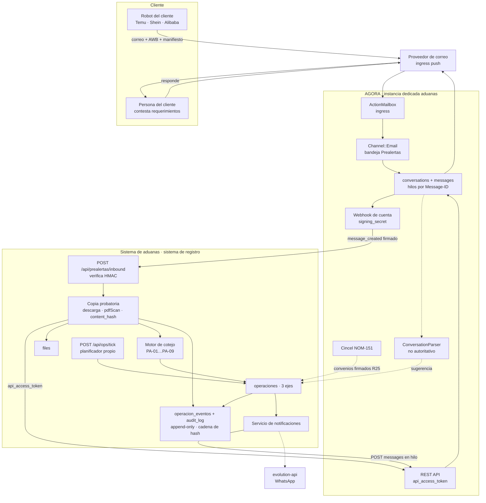
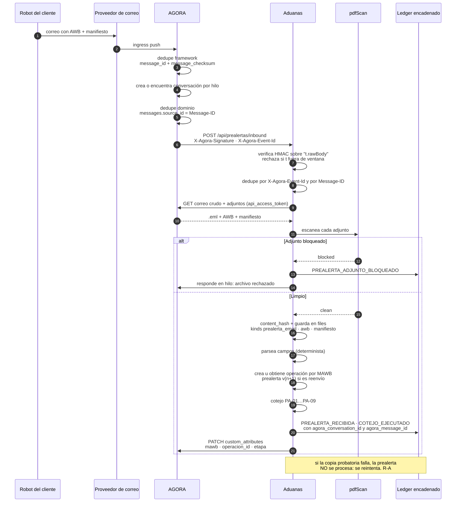
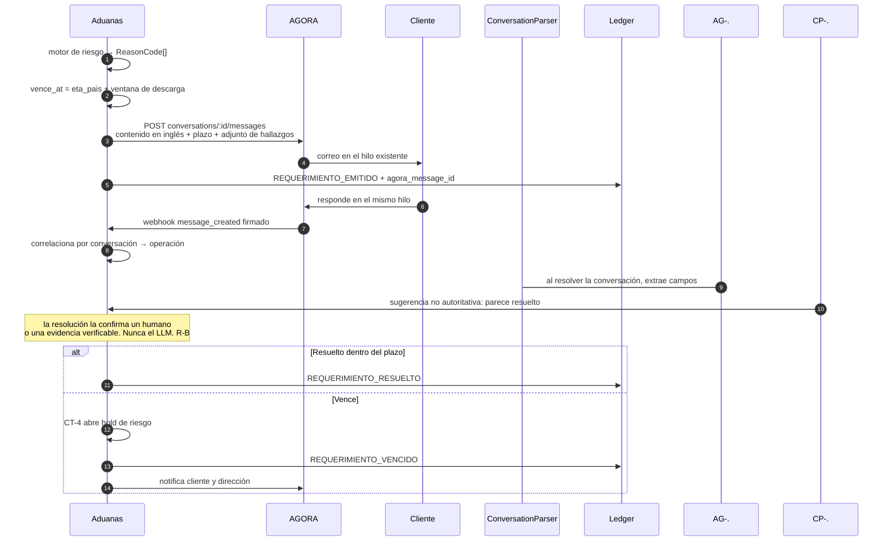
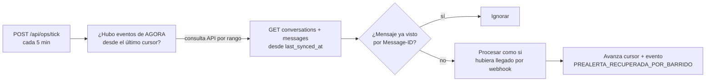

# PRD-02 · Adenda A — Integración con AGORA como hub de correo y comunicación con el cliente

**Documento:** adenda al `docs/PRD_sistema_operaciones.md` (PRD-02).
**Fecha:** 1 de agosto de 2026.
**Pregunta que responde:** ¿podemos resolver la ingesta de prealertas y la comunicación con el cliente reutilizando AGORA, en lugar de construirlo dentro del sistema de aduanas? ¿Qué debe quedar forzosamente del lado de aduanas?
**Fuente:** lectura del repositorio `AGORA` en la rama `integ/dreams-team-sync`, más el estado real del despliegue en Coolify.

---

## 1. Veredicto

**Sí, y conviene.** AGORA cierra la brecha de infraestructura más peligrosa que tenía el PRD-02 (`Q13`: no existe correo ni entrante ni saliente en el repositorio de aduanas) con una implementación real, no un juguete: ActionMailbox con ingress de proveedor, hilos de correo con `Message-ID`/`In-Reply-To`/`References` correctamente construidos, SMTP por bandeja, webhooks **firmados con HMAC**, reglas de automatización que filtran por asunto y remitente, y adjuntos gestionados por ActiveStorage.

**Pero con una frontera dura, no negociable:** AGORA es **capa de transporte e interacción**, nunca **sistema de registro**. Todo lo que la autoridad pueda auditar tiene que vivir en aduanas, dentro de su cadena de hash. Esto no es purismo arquitectónico — se deriva de dos hechos verificados en el código:

1. **AGORA borra la evidencia a los 30 días.** El correo crudo se guarda en `action_mailbox_inbound_emails` como blob de ActiveStorage, y este repositorio **no sobreescribe `ActionMailbox.incinerate_after`**, así que aplica el default de Rails: 30 días y se incinera. Además, por la vía IMAP el crudo **nunca se guarda** — sólo un subconjunto curado de campos.
2. **Las tablas de AGORA son mutables.** `conversations`, `messages`, `contacts` se editan y se borran normalmente. La tesis completa frente a Anticorrupción es "esto no se puede mover"; eso lo da `audit_log` + `operacion_eventos` con trigger append-only, no una bandeja de correo.

De ahí la regla operativa: **el sistema de aduanas copia toda evidencia a su propio almacén en el momento de recibirla**, la escanea, le calcula hash y la encadena. AGORA queda como el medio por el que llegó y por el que se contesta.

---

## 2. Qué es AGORA hoy (hechos, no impresiones)

| Hecho | Detalle |
|---|---|
| Naturaleza | Fork de **Chatwoot** sobre Rails 7.1, Ruby 3.4.4 |
| Divergencia | **843 commits / ~124 000 inserciones** por delante de `develop` |
| Cliente al que está acoplado | **CEA Querétaro** (organismo municipal de agua): módulos Aquacis, Tickets, Trámites, facturación, taxonomías `FUG/PAG/LEC/CON` |
| Canales | email, whatsapp, web widget, api, form, facebook, instagram, telegram, line, sms, twilio, twitter, tiktok, voice, elevenlabs_voice, qrobot |
| Motor de flujos | Grafo real: nodos `trigger, condition, switch, lookup, action, wait, await, approval, split, join, ai, cluster`, con fan-out/join por tokens, suspensión/reanudación, y `node_trace` jsonb como auditoría por paso |
| **Sin nodo HTTP** | El nodo `http` existe **sólo** en la rama sin fusionar `feat/workflow-http-node-reporter-approval` |
| Firma electrónica | Integración **Cincel** (NOM-151) ya construida — relevante para `R25`/D9 |
| IA | Tres subsistemas distintos: `ConversationParser` (extracción de campos con LLM), Captain (RAG enterprise), AI Agents (runtime propio) |
| Async | Sidekiq + sidekiq-cron, colas priorizadas, con precedentes de barrido de reconciliación |
| Estado en Coolify | App `AGORA` desplegada, **SMTP saliente ya configurado**, `OPENAI_API_KEY` presente, pero **sin FQDN, logs del 2026-04-07, rama `thefuture`** — está apagada en la práctica |
| Correo entrante | **No configurado** en ese despliegue: faltan `RAILS_INBOUND_EMAIL_SERVICE`, `MAILER_INBOUND_EMAIL_DOMAIN`, `RAILS_INBOUND_EMAIL_PASSWORD` |

### 2.1 Lo que AGORA hace bien y nos sirve tal cual

- **Ingesta de correo en tiempo real.** `config.action_mailbox.ingress` acepta `relay | mailgun | mandrill | postmark | sendgrid | ses`. Con ingress de proveedor la entrega es push, no polling.
- **Deduplicación de correo.** Doble: a nivel framework por índice único `(message_id, message_checksum)` en `action_mailbox_inbound_emails`, y a nivel dominio por `messages.source_id == Message-ID`. Esto satisface directamente la idempotencia que el PRD-02 pedía en `prealertas.message_id`.
- **Hilos correctos.** Salida con `Message-ID` = `<conversation/<uuid>/messages/<id>@dominio>`, `In-Reply-To` y `References` plegados según RFC 5322 (`app/mailers/references_header_builder.rb`). La respuesta del cliente **regresa a la misma conversación**. Construir esto bien a mano es de las cosas que más se subestiman.
- **Webhooks firmados.** Adición propia del fork: si el webhook tiene `signing_secret`, sale con
  `X-Agora-Signature: t=<unix>,v1=<hex hmac_sha256(secret, "<t>.<raw_body>")>` y `X-Agora-Event-Id: <uuid>`.
  El secreto se guarda cifrado y nunca se devuelve por API.
- **Filtrado antes de notificar.** Las reglas de automatización sobre `message_created` pueden condicionar por `mail_subject`, `email`, `content`, `inbox_id`, y por atributos personalizados — con operadores `contains`, `equal_to`, `starts_with`, `is_present`, etc.
- **Envío programático con adjuntos.** `POST /api/v1/accounts/:id/conversations/:id/messages` acepta `content`, `cc_emails`, `bcc_emails`, `to_emails` y `attachments` (subida directa vía `direct_uploads` → `signed_id`).
- **Atributos personalizados consultables.** `custom_attribute_definitions` + `custom_attributes` jsonb en conversación y contacto, filtrables por API y por reglas.
- **Portal del contacto.** `contacts` ya trae columnas Devise y `portal_role` — el portal del cliente de la fase 3 del PRD-02 podría no tener que construirse desde cero.
- **Precedente idéntico al nuestro.** El fork ya expone rutas `agent/*` autenticadas con un token estático (`X-Agent-Token` comparado con `secure_compare` contra `AGENT_API_TOKEN`) para que un sistema externo de gobierno hable con AGORA. Ya existe el patrón que necesitamos.

### 2.2 Lo que NO hace, y que cambia el diseño

| # | Hallazgo | Consecuencia para aduanas |
|---|---|---|
| G1 | **Incineración a 30 días** del correo crudo, y **cero retención de crudo por la vía IMAP** | Aduanas **debe copiar** el `.eml` a su propio `files` al recibir el webhook. Retención fiscal ~5 años. |
| G2 | Sólo se persiste un **subconjunto curado de cabeceras** (`from, to, cc, bcc, subject, date, message_id, in_reply_to, references, html_content, text_content, …`). Cabeceras `X-*` arbitrarias se pierden | Si el robot del cliente mete algo en cabeceras propias, se pierde por IMAP. Otra razón para usar ingress y copiar el crudo. |
| G3 | **Sin escaneo de malware** y **sin lista blanca de content-type** para adjuntos de correo (la validación existe sólo para `Channel::WebWidget`) | Aduanas **debe escanear** todo adjunto con su `server/src/services/pdfScan/` antes de procesarlo. Los adjuntos vienen de robots de e-commerce chino: es exactamente el vector que no se puede confiar. |
| G4 | **Sin manejo de bounces ni quejas.** `MailPresenter#bounced?` existe y **nunca se invoca** — es código muerto. No hay controlador SNS, ni lista de supresión | Grave para `R18`: si el correo del requerimiento de riesgo **rebota**, nadie se enteraría, y le detendríamos la carga a un cliente que nunca fue notificado. Necesita mitigación explícita (§6). |
| G5 | Los adjuntos llegan al webhook como **URL**, no como bytes | Aduanas hace una segunda llamada autenticada para bajarlos. |
| G6 | **`send_webhook_event` de las reglas de automatización NO va firmado** — es un `WebhookJob` crudo sin HMAC | Usar **webhook de cuenta con `signing_secret`**, no la acción de la regla, para el camino que crea casos. |
| G7 | **`ConversationParser` se dispara en `conversation_resolved`** y por barrido horario — no al llegar el mensaje | No sirve para parsear la prealerta en el momento. Y no debería: el parseo autoritativo tiene que ser determinista y versionado. |
| G8 | **Sin nodo HTTP** en el motor de flujos de esta rama | La orquestación (vuelos, contingencias, replaneación) se queda en aduanas. AGORA no puede llamar al SAT ni a un feed de vuelos desde un flujo. |
| G9 | La instancia desplegada está **acoplada a CEA**: `FRONTEND_URL` es constante de proceso que los mailers **siempre** usan, `AGENT_ACCOUNT_ID=1` literal, y `docker-compose.coolify.yaml` tiene **`SECRET_KEY_BASE` y contraseñas de Postgres/Redis versionadas en el repositorio** | **Instancia separada para aduanas.** No compartir proceso con datos de producción de un cliente de gobierno. |
| G10 | `.planning/STATE.md` documenta un endurecimiento de seguridad **en curso, fase 6 de 10**, con hallazgos catalogados: proxies sin autenticar, mass assignment, falta de CSP, FKs/índices/NOT NULL faltantes | Riesgo de dependencia. Se acota usando sólo la superficie de correo + API + webhooks, y aislando la instancia. |

> **Aparte, y con independencia de este proyecto:** los secretos versionados en `docker-compose.coolify.yaml` (`SECRET_KEY_BASE`, `AgoraDB2026Secure`, `AgoraRedis2026Key`) deberían rotarse y moverse a variables de Coolify. Están en el historial de git.

---

## 3. El principio de frontera

> **AGORA es el medio. Aduanas es el registro.**
> Todo lo que un auditor pueda pedir, existe en aduanas con hash. Todo lo que un humano lea o conteste, pasa por AGORA.

De ahí se derivan tres reglas mecánicas:

- **R-A · Copia inmediata.** Ningún artefacto probatorio queda sólo en AGORA. Al recibir el webhook, aduanas descarga `.eml` + adjuntos, los escanea, calcula `content_hash`, los guarda en `files` y emite el evento encadenado. Si la copia falla, el caso se marca y se reintenta; no se procesa la prealerta sobre datos que no se pudieron archivar.
- **R-B · Determinismo en lo autoritativo.** El cotejo (`PA-01`…`PA-09`) y las máquinas de estado son código versionado con hash de ruleset, en aduanas. Ningún LLM decide un `piezas` o un semáforo. La IA se usa donde no es autoritativa (§5.3).
- **R-C · Una sola cadena.** Los `agora_message_id` / `agora_conversation_id` se guardan como referencias dentro de `operacion_eventos`, que sigue siendo el único ledger. No hay una segunda fuente de verdad.

---

## 4. Tabla de frontera

Leyenda: **A** = lo provee AGORA · **C** = específico de aduanas · **H** = híbrido (AGORA transporta, aduanas registra)

| Capacidad | PRD-02 | Dueño | Justificación |
|---|---|---|---|
| Recepción del correo de prealerta | `R1` | **A** | ActionMailbox + ingress de proveedor. Cierra `Q13`. |
| Idempotencia por `Message-ID` | `R1`,`R6` | **A** | Doble dedupe ya implementado. |
| Archivo probatorio del correo crudo | `N1` | **C** | G1: AGORA incinera a 30 días. Aduanas retiene y encadena. |
| Escaneo de adjuntos (malware, contenido activo, QR) | seguridad | **C** | G3: AGORA no escanea. `pdfScan` ya existe en aduanas. |
| Parseo de campos de la prealerta | `R2` | **C** | R-B: determinista y versionado, no LLM. |
| Cotejo `PA-01`…`PA-09` | `R5` | **C** | Reglas de dominio aduanero. AGORA no sabe qué es una guía máster. |
| Versionado de prealerta por reenvío | `R6` | **H** | AGORA entrega el hilo; aduanas versiona el caso. |
| Resolución cliente ↔ remitente | `R1` | **H** | AGORA tiene `contacts`; aduanas ya tiene `client_platforms.email`. Se sincronizan. |
| Seguimiento de vuelo | `R8`,`R9` | **C** | G8: sin nodo HTTP no hay forma de que AGORA consulte un feed. |
| Máquinas de estado (3 ejes), holds, retenciones | `R17`,`CT-*` | **C** | Núcleo del dominio. |
| Motor de contingencias / replaneación | `R17` | **C** | Idem, y debe ser auditable y determinista. |
| **Requerimiento de riesgo al cliente con plazo duro** | `R18` | **H** | Aduanas calcula el plazo y el contenido; AGORA lo envía **en hilo** y captura la respuesta. Mejor que SMTP crudo: queda historial consultable. |
| Notificación de cambio de plan a almacén / transportista / cliente | `R19`,`N5` | **H** | Igual. Y por WhatsApp también, vía `evolution-api` que ya corre. |
| Bandeja de trabajo humana sobre esas conversaciones | — | **A** | Beneficio no pedido: el equipo de Luis atiende correos de clientes en una bandeja con asignación, etiquetas y SLA. |
| Envío del POD al cliente y captura de su firma/acuse | `R39` | **H** | Aduanas genera el PDF; AGORA lo envía y recibe la respuesta. |
| Generación del POD | `R39` | **C** | Formato aduanero. |
| Contratos de transportista firmados digitalmente | `R25`,D9 | **A** | **Cincel/NOM-151 ya está integrado en AGORA.** Reutilizar en vez de contratar otro PSC. |
| Portal del cliente en inglés | fase 3 | **A** parcial | `contacts` ya tiene login y `portal_role`. Evaluar antes de construir. |
| App de campo del tramitador | `R11`,`R31`–`R35` | **C** | Necesita cola offline y foto con hora de dispositivo ligada a la operación. |
| Planeación, despacho, catálogos de transporte | `R13`–`R29` | **C** | Dominio. |
| Trazabilidad financiera guía↔piezas↔factura | `R43`–`R48` | **C** | Dominio fiscal mexicano. |
| Cadena de hash y bitácora append-only | `N1` | **C** | Es la tesis del proyecto. |
| Vista de autoridad | `N3` | **C** | Debe leer del ledger de aduanas. |
| **Planificador de tareas periódicas** | `Q14` | **C** | AGORA tiene Sidekiq-cron, pero es *su* planificador. Aduanas sigue necesitando el suyo. **`Q14` no se resuelve con AGORA.** |
| Clasificación de respuestas libres del cliente | nuevo | **A** | `ConversationParser` con LLM: no autoritativo, sólo sugiere si el cliente ya contestó. Aquí sí encaja la IA. |

**Resumen:** AGORA resuelve `Q13` completo, aporta el hub de comunicación que el PRD-02 no tenía, y regala la firma digital de `R25`. **No** resuelve `Q14`, **no** resuelve el cotejo ni la orquestación, y **obliga** a añadir el paso de copia probatoria.

---

## 5. Arquitectura de integración

### 5.1 Topología



### 5.2 Secuencia: ingesta de prealerta con copia probatoria



### 5.3 Secuencia: requerimiento de riesgo con plazo duro



### 5.4 Reconciliación: qué pasa si se cae el webhook

Precedente tomado de AGORA misma, que ya usa este patrón en `supra_reconcile_pending_tramites_job` y `cincel_poll_status_job`.



Esto convierte el webhook en un camino rápido y el barrido en la garantía. Sin él, un AGORA caído durante una ventana de vuelo significa carga sin planear.

---

## 6. Contrato de integración

### 6.1 Configuración en AGORA (una vez)

1. **Instancia dedicada.** Nuevo stack de Coolify a partir de `docker-compose.coolify.yaml`, con su propio `SECRET_KEY_BASE`, su Postgres/Redis y su dominio. **No** compartir con la instancia de CEA. Candidato: reutilizar la app `AGORA` que ya existe en Coolify y está apagada, previa verificación de que no es producción de CEA.
2. **Ingress de correo.** `RAILS_INBOUND_EMAIL_SERVICE` = proveedor elegido (`Q15`), `MAILER_INBOUND_EMAIL_DOMAIN`, y la clave del proveedor (`MAILGUN_INGRESS_SIGNING_KEY` / `RAILS_INBOUND_EMAIL_PASSWORD` / `ACTION_MAILBOX_SES_SNS_TOPIC` según el caso).
3. **Retención.** Poner `ActionMailbox.incinerate_after` explícitamente, aunque la copia en aduanas ya cubra la retención — para que quede escrito cuál es la política y no dependa de un default.
4. **Cuenta y bandeja.** Una `Account` para aduanas; una bandeja `Channel::Email` "Prealertas" con la dirección a la que apuntan los robots de los clientes; opcionalmente una segunda bandeja "Clientes" para comunicación general.
5. **Definiciones de atributos.** `custom_attribute_definitions` de tipo `conversation_attribute`: `mawb` (text), `operacion_id` (text), `etapa` (list), `semaforo` (list: green/red). Esto permite que la bandeja humana muestre el contexto aduanero y que las reglas filtren por él.
6. **Webhook de cuenta.** `POST /api/v1/accounts/:id/webhooks` con `subscriptions: ["message_created","conversation_created"]`, `url` = endpoint de aduanas, y **`signing_secret`** generado. No usar `send_webhook_event` de una regla de automatización para este camino (G6).
7. **Token de API.** Un `User` con rol de agente en esa cuenta, y su `api_access_token`. Se prefiere sobre un `AgentBot` porque el bot está limitado a 3 endpoints y aduanas necesita además descargar adjuntos y leer conversaciones.
8. **Regla de automatización opcional** sobre `message_created` con condición `inbox_id equal_to <Prealertas>` para etiquetar automáticamente y asignar equipo. El filtrado que importa lo hace aduanas.

### 6.2 Del lado de aduanas

**Nuevas columnas** (añadir a las migraciones ya planeadas en PRD-02 §8.5):

| Tabla | Columna | Tipo |
|---|---|---|
| `operaciones` | `agora_conversation_id` | text, índice |
| `operaciones` | `agora_contact_id` | text |
| `prealertas` | `agora_message_id` | text, índice |
| `prealertas` | `agora_event_id` | text **UNIQUE** — idempotencia del webhook |
| `riesgo_requerimientos` | `agora_message_id` | text |
| `notificaciones` | `agora_message_id` | text |
| nueva `integracion_cursores` | `fuente` text, `last_synced_at` timestamptz, `last_event_id` text | para el barrido de §5.4 |

**Widen `files_kind_check`** para incluir `prealerta_email` (el `.eml` crudo) — ya estaba previsto en PRD-02.

**Nuevas variables de entorno**, que **sustituyen** a `MAIL_PROVIDER`/`MAIL_API_KEY`/`MAIL_FROM` del PRD-02 §17:

```
AGORA_BASE_URL
AGORA_ACCOUNT_ID
AGORA_API_ACCESS_TOKEN
AGORA_WEBHOOK_SIGNING_SECRET
AGORA_PREALERTAS_INBOX_ID
AGORA_SIGNATURE_TOLERANCE_SEC   # ventana anti-replay, p. ej. 300
```

**Verificación de firma** (Node, en `POST /api/prealertas/inbound`) — debe correr sobre el **cuerpo crudo**, antes de cualquier parseo de JSON:

```ts
// El body parser debe estar configurado con `verify` para conservar el raw buffer,
// porque el HMAC se calcula sobre "<t>.<rawBody>" exacto.
function verifyAgoraSignature(header: string, rawBody: Buffer, secret: string, toleranceSec: number): boolean {
  const parts = new Map(header.split(',').map((kv) => kv.split('=') as [string, string]));
  const t = Number(parts.get('t'));
  const v1 = parts.get('v1');
  if (!t || !v1) return false;
  if (Math.abs(Date.now() / 1000 - t) > toleranceSec) return false;            // anti-replay
  const expected = createHmac('sha256', secret).update(`${t}.${rawBody}`).digest('hex');
  const a = Buffer.from(expected, 'hex'); const b = Buffer.from(v1, 'hex');
  return a.length === b.length && timingSafeEqual(a, b);                        // comparación en tiempo constante
}
```

**Orden obligatorio del handler**, derivado de R-A:

1. Verificar firma y ventana temporal → 401 si falla.
2. Dedupe por `agora_event_id` (unique) y por `Message-ID` → 200 idempotente si repetido.
3. Descargar `.eml` y adjuntos con `AGORA_API_ACCESS_TOKEN`.
4. `pdfScan` cada adjunto. Si `blocked`, registrar evento, contestar en el hilo y **no** procesar.
5. `content_hash` + `saveFile` de los tres artefactos.
6. Sólo entonces: parsear, crear/versionar la operación, cotejar, encadenar eventos.
7. Escribir `custom_attributes` de vuelta en AGORA para que la bandeja humana tenga contexto.

Si 3–5 fallan, responder 5xx para que Sidekiq reintente, y dejar el caso en un estado visible. **Nunca** procesar una prealerta cuya evidencia no se pudo archivar.

**Envío de mensajes** (notificaciones `R18`/`R19`/POD): `POST {AGORA_BASE_URL}/api/v1/accounts/{id}/conversations/{cid}/messages` con header `api_access_token`. Para adjuntos grandes, primero `POST .../direct_uploads` y pasar el `signed_id`. Contenido del cliente **en inglés** (`N6`).

### 6.3 Mitigación del hueco de rebotes (G4)

Este es el riesgo con consecuencia legal, así que se atiende explícitamente y no se deja al proveedor:

- El requerimiento se considera **notificado** sólo cuando AGORA confirma envío; si el `Message` queda en `status: failed`, aduanas lo detecta por el webhook `message_updated` y **no** arranca el reloj de `vence_at`.
- Un requerimiento sin acuse a las N horas escala: segundo canal (**WhatsApp por `evolution-api`**, que ya corre) y aviso interno a dirección.
- La vista de Torre de Control muestra los requerimientos **emitidos pero sin confirmación de entrega** como una categoría propia. No se le detiene carga a nadie por un correo que rebotó.
- Configurar en el proveedor de correo el reporte de bounces hacia un endpoint de aduanas, ya que AGORA no lo procesa.

---

## 7. Lo que sería tentador y es un error

| Tentación | Por qué no |
|---|---|
| Modelar la operación como un `Ticket` o `Tramite` de AGORA | Partiría el sistema de registro en dos, en tablas mutables, dentro de una base compartida. La autoridad audita **una** cadena. |
| Usar `ConversationParser` para parsear la prealerta | Se dispara en `conversation_resolved`, no al llegar (G7); y un LLM extrayendo `piezas` de forma no determinista es precisamente lo que Anticorrupción atacaría. El cotejo debe ser reproducible con hash de ruleset. |
| Mover el motor de contingencias a los flujos de AGORA | Sin nodo HTTP (G8) no puede consultar vuelos ni SAT. Y el `node_trace` de AGORA no está en nuestra cadena de hash. |
| Correr aduanas como cuenta #2 en la instancia de CEA | G9: `SECRET_KEY_BASE` compartido y versionado, `FRONTEND_URL` global que los mailers siempre usan, base de datos compartida con producción de un cliente de gobierno. |
| Depender de AGORA para retener evidencia | G1: 30 días y se incinera. |
| Confiar en los adjuntos que entrega AGORA | G3: no hay escaneo ni lista blanca. |
| Usar `send_webhook_event` de una regla para crear casos | G6: va sin firma. |

---

## 8. Cambios al PRD-02

| Sección de PRD-02 | Cambio |
|---|---|
| `Q13` (proveedor de correo) | **Resuelta**: AGORA es el hub. Queda la sub-decisión del ingress → nueva `Q15`. |
| `Q14` (planificador) | **Sigue abierta.** AGORA no la resuelve; aduanas necesita su propio tick. |
| §10 "Tarea programada — hueco de infraestructura" | Se reduce: el correo entrante y saliente sale de la lista. El planificador se queda. |
| `R1` ingesta de prealerta | Cambia de "webhook de proveedor o IMAP propio" a "webhook firmado de AGORA + copia probatoria obligatoria". |
| `R18`,`R19`,`N5` | Se envían por la API de AGORA, en hilo, con historial. Se añade la mitigación de rebotes. |
| `R25`/D9 firma digital de convenios | **Reutilizar Cincel de AGORA** en lugar de contratar PSC aparte. Baja el costo y el riesgo. |
| Portal del cliente (fase 3) | Evaluar el portal de contactos de AGORA antes de construirlo. |
| §8.5 modelo de datos | Añadir las columnas `agora_*` y la tabla `integracion_cursores` de §6.2. |
| §17 variables de entorno | `MAIL_PROVIDER`/`MAIL_API_KEY`/`MAIL_FROM` → sustituidas por el bloque `AGORA_*`. |
| §14 fase 0 | Se añade el ítem de instancia AGORA + ingress; se quita "construir correo". Neto: menos trabajo. |
| §15 riesgos | Nuevos: G1 retención, G4 rebotes, G10 endurecimiento en curso, y dependencia operativa de una segunda plataforma. |

### 8.1 Fase 0 revisada — impacto en el viernes

| Trabajo | Antes | Con AGORA |
|---|---|---|
| Correo entrante | construir ingesta desde cero, decidir proveedor, IMAP o webhook, threading, dedupe | **configurar** ingress + bandeja + webhook |
| Correo saliente | elegir proveedor, plantillas, threading | **ya configurado** en el despliegue existente |
| Hilos y respuestas del cliente | no estaba contemplado | gratis, y además queda bandeja humana |
| Copia probatoria y escaneo | implícito | **trabajo nuevo explícito**, ~1 día |
| Reconciliación por barrido | no estaba contemplado | **trabajo nuevo**, ~0.5 día |
| Instancia AGORA aduanas | — | **trabajo nuevo de ops**, ~1 día |

**Estimación:** ~2.5 días de trabajo, contra bastante más si se construyera el correo dentro de aduanas — y con mejor resultado, porque se gana el hub de comunicación y el historial auditable de la conversación con el cliente, que el PRD-02 no tenía en ninguna fase.

---

## 9. Riesgos nuevos

| # | Riesgo | Mitigación |
|---|---|---|
| A1 | **Retención de 30 días** en AGORA (G1) | R-A: copia inmediata a `files` con hash. Fijar `incinerate_after` explícitamente. |
| A2 | **Rebotes silenciosos** (G4) con consecuencia legal en `R18` | §6.3: no arrancar el reloj sin confirmación, escalar a WhatsApp, categoría visible en Torre de Control, bounces del proveedor a un endpoint de aduanas. |
| A3 | **Adjuntos sin escanear** (G3) desde robots de e-commerce | `pdfScan` obligatorio antes de procesar; bloqueado ⇒ no se procesa. |
| A4 | **Segunda plataforma en el camino crítico**: si AGORA cae, las prealertas se retrasan | El proveedor encola; el barrido de §5.4 recupera; y la operación degrada a carga manual del manifiesto, que es el flujo actual y sigue existiendo. |
| A5 | **Endurecimiento de seguridad en curso** en AGORA (G10) | Superficie mínima: sólo correo + API + webhooks. Instancia aislada. No exponer la UI de AGORA a la autoridad. |
| A6 | **Divergencia del fork** (843 commits) y rama desplegada distinta (`thefuture` ≠ `integ/dreams-team-sync`) | Fijar la rama de la instancia de aduanas y no seguir `develop` automáticamente. |
| A7 | Acoplamiento a CEA si se comparte instancia (G9) | Instancia dedicada. |
| A8 | Ampliar la superficie de datos personales: contactos y conversaciones de clientes ahora en dos sistemas | Reflejar en el aviso de privacidad; cifrado de contactos ya existe en aduanas; definir retención en ambos lados. |

---

## 10. Preguntas abiertas nuevas

| # | Pregunta | Para | Bloquea |
|---|---|---|---|
| `Q15` | **Ingress de correo**: ¿Mailgun, Postmark, SendGrid, SES o relay propio? Determina claves y coste | Alfonso / Fernando | configuración del viernes |
| `Q16` | ¿Se reutiliza la app `AGORA` apagada de Coolify como instancia de aduanas, o se crea un stack nuevo? Requiere confirmar que esa app **no** es producción de CEA | Fernando | despliegue |
| `Q17` | ¿Qué dominio para el correo de prealertas? Los robots de los clientes tendrán que apuntar ahí, y cambiarlo después es caro | Alfonso / Luis | hay que avisar a los clientes con tiempo |
| `Q18` | ¿Se fusiona `feat/workflow-http-node-reporter-approval` para tener nodo HTTP en los flujos de AGORA? No es necesario para el viernes | Fernando | fases posteriores |
| `Q19` | ¿Se adopta Cincel de AGORA para los convenios de transportista (`R25`), o se contrata PSC aparte? | Alfonso | fase 2 |
| `Q20` | ¿Se usa el portal de contactos de AGORA para el portal del cliente en inglés, o se construye en aduanas? | Fernando | fase 3 |

**Nota de higiene, independiente de este proyecto:** rotar `SECRET_KEY_BASE` y las contraseñas de Postgres/Redis que están versionadas en `docker-compose.coolify.yaml`, y sacarlas a variables de Coolify.
